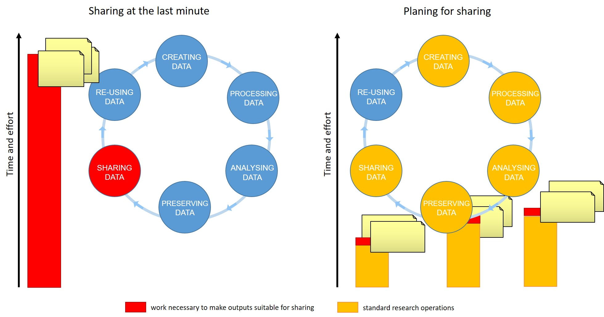

## Introductions

> Introductions set the stage for learning.
>
> --- Tracy Teal, Former Executive Director, The Carpentries
{: .testimonial}

Hello everyone, and welcome to **FAIR in biological practice** workshop.
We are very pleased to have you with us.

> ## Today's Trainers
>
> To begin class, each Trainer should give a brief introduction of themselves.
>
{: .discussion}

Now we would like to get to know all of you.

> ## Who are you and what are your expectations from the workshop
>
> Please introduce yourself shortly and tell us:
>
> * Why are you taking this course?
> * What goals do you have for the follwing days?
>
{: .challenge}

## Better research by better sharing

For many of us, data management or outpust sharing in general
are considered a burden rather than a useful activity. Part of the problem
is our bad timing and lack of planing.

**Data management is a continuous process**

*Figure credits: Tomasz Zielinski and Andrés Romanowski*

When should you engage in data sharing and open practices?
* Data management should be done throughout the duration of your project.
* If you wait till the end, it will take a massive effort on your side and will be more of a burden than a benefit.
* Taking the time to do effective data management will help you understand your data better and make it easier to find it when you need it (for example when you need to write a manuscript or a thesis!).
* All the practices that enable others accessing and using your outcomes directly
benefit you and your group

In this workshop we will show you how you can plan and do your research so
in a way that it makes your outputs readily available for re-use by others.

Our agenda:
* **Day 1**
We will start with explaining Open Science principles and what are
the benefits of being open for you and the whole society.
Then we will talk about FAIR principles which define steps you we shout take
that our "shared" outputs are of value.
We will finish with how to plan our work to deliver FAIR outputs.
* **Day 2**
We will show the benefits of using online records for documenting experiments.
We will talk about working and organizing files and using Excel or CSV tables
to store and document data.
* **Day 3**
We will teach how to describe your projects using simple text files or customized templates.
We will talk about Version Control.
* **Day 4**
We will show you how public repositories makes your outputs accessible and reusable.
We will consolidate our knowledge of FAIR ready data managment and what
other tools can help you during your research.

## Online workshop specifics

> ## Our learning tools
>
> Before we begin let's explain how to use the tools:
> * Raising hands,
> * Yes/No sticker
> * Chatroom for links not for jokes
> * Breakout rooms, leaving and rejoining
> * using pad, answering questions in pad
> * where to find things
> If needed, check the pre workshop setup, ask to report problems
> and help at a break or after the session.
>
{: .discussion}


