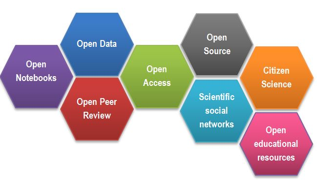

Science works best by exchanging ideas and building on them. Most efficient science involves both questions and
experiments being made as fully informed as possible, which requires the free exchange of data and information.

All practices that make knowledge and data **freely available** fall under the umbrella-term of **Open Science/Open
Research**. It makes science **more reproducible, transparent, and accessible**. As science becomes more open, the way
we conduct and communicate science changes continuously.

### What is the Open Science movement?

Sharing of information is fundamental for science. This began at a significant scale with the invention of scientific
journals in 1665. At that time this was the best available alternative to critique & disseminate research, and foster
communities of like-minded researchers.

Whilst this was a great step forward, the journal-driven system of science has
led to a culture of ‘closed’ science, where knowledge or data is unavailable or unaffordable to many. Counter to this
‘closed’ state, Open Science is the movement to increase transparency and reproducibility of research, through using
Open Science best practices.

Open Science is advantageous to all parties involved in science (including
researchers, funding bodies, the public, journals, etc...), which is leading to a push for the widespread adoption of
Open Science practices.

The distribution of knowledge has always been subject to improvement. Whilst the internet was initially developed for
military purposes, it was hijacked for communication between scientists, which provided a viable route to change the
dissemination of science. The momentum has built up with a change in the way science is communicated to reflect what
research communities are calling for – solutions to the majority of problems (e.g. impact factors, data reusability,
reproducibility crisis, trust in the public science sector etc...) that we face today.

*After [Gema Bueno de la Fuente](https://www.fosteropenscience.eu/content/what-open-science-introduction)*

* **Open Access:** Research outputs hosted in a way that make them accessible for everyone. Traditionally Open Access
  referred to journal articles, but now includes books, chapters or images.

* **Open Data:** Data freely and readily available to access, reuse, and share.
  Smaller data sets were often accessible as
  supplemental materials by journals alongside articles themselves.
  However, they should be hosted in dedicated platforms for
  more convenient and better access.

* **Open Software:** Software where the source code is made readily available;
  others are free to use, change, and
  share. Some examples of these including the coding language and supporting software R and RStudio,
  as well as image analysis software such as Fiji/ImageJ.

* **Open Notebooks:** Lab & notebooks hosted online, readily accessible to all. These are popular among some of the
  large funding bodies and allow anyone to comment on any stage of the experimental record.

* **Open Peer Review:** A system where peer review reports are published alongside the body of work. This can include
  reviewers' reports, correspondence between parties involved, rebuttals, editorial decisions etc...

> ## Goals of Open Science
>
> For the following OS parts:
> * Open Access
> * Open Data
> * Open Software
> * Open Notebooks
> * Open Peer Review
>
> discuss what are the main goals or problems that are being addressed
> by those Open initiatives.
>
> For example:
> Open educational resources:
> - makes quality teaching materials widely available
> - permits collaborative development of courses
> - improves teachers/instructors skills by sharing ideas
>
> *The Trainer may have you discuss in small groups one initiative each and
> then gather your thoughts together as a group.*
>
>> ## Solution
>>
>> **Open Access**
>> * speed of knowledge distribution
>> * leveling field for underfunded sites which otherwise wouldn’t be able to navigate the paywall
>> * prevent articles being paid for ‘thrice’ (first to produce, second to publish, third to access) by institutions.
>> * greater access to work by others, increasing chance for exposure & citations
>> * access to work by lay audiences, thus increases social exposure of research
>>
>> **Open Data**
>> * ensures data isn’t lost overtime
>> * acceleration of scientific discovery rate
>> * permits statistical re-analysis of the data to validate findings
>> * gives access to datasets which were not published as papers (e.g. negative results, large screening data sets)
>> * provides an avenue to generate new hypotheses
>> * permits combination of multiple data sources to address questions, provides greater power than a single data source
>>
>> **Open Software**
>> * great source to learn programming skills
>> * the ability to modify creates a supportive community of users and rapid innovation
>> * faster bug fixes
>> * better error scrutiny
>> * use of the same software/code allows better reproducibility between experiments
>>
>> **Open Notebooks**
>> * 100% transparent science, allowing input from others at early stages of experiments
>> * source of learning about the process of how science is actually conducted
>> * allows access to experiments and data which otherwise never get published
>> * provides access to ‘negative’ results and failed experiments
>> * anyone, anywhere around the world, at any time, can check in on projects, including many users simultaneously
>> * thorough evidence of originality of ideas and experiments, negating effect of ‘scooping’
>>
>> **Open Peer Review**
>> * visibility leads to more constructive reviews
>> * mitigates against editorial conflicts of interest and/or biases
>> * mitigates against reviewers conflicts of interest and/or biases
>> * allows readers to learn/benefit from comments of the reviewers
>>
> {: .solution}
{: .challenge}

### Why to get involved

One has to consider the moral objectives that
accompany the research/publication process: charities/taxpayers pay to fund research, these then pay again to access the
research they already funded. The goals of Open Science is to make research and research data available to e.g.
charities/taxpayers who funded this research.

COAlition S, a group of national research funding organisations backed by
the European Commission and the European Research Council, is a big driver trying to get rid of the paywalls that our
research is sat behind. They announced Plan S, an initiative to make research publications fully free at the point of
access, meaning that all research funded by public funding bodies must be published Open Access from 2021 onwards.

Large UK funding bodies such as The Wellcome Trust are big supporters of Open Science and many journals are coming out to
publicly support Open Science.

> ## Personal benefits of being "open"
>
> Below are some personal benefits to adopting Open Science practices:
>
> * get extra value from your work (e.g. collaborators, reuse by modelers, ML specialists)
> * complying with funders’ policies
> * receive higher citations
> * demonstrate research impact
> * save own time (reproducibility but also communication overhead)
> * become pioneers
> * distinguish yourself from the crowd
> * plan successful research proposals
> * gain valuable experience
> * form community
> * increased speed and/or ease of writing papers
> * speed up and help with peer review
> * build reputation and presence in the science community
> * evidence of your scientific rigour and work ethic
> * avoid embarassment/disaster when you can't reproduce your results
>
>
> which of them are the strongest motivators for you, rank them.
>
> Can you think of other benefits?
> How personal benefits of Open Science compare to the benefits
> for the (scientific) society.
>
> {: .discussion}

> ### Open Access (successful example)
>
> Under the closed system of pay-to-access articles, research output is placed behind a paywall, with journals and
> shareholders being the only beneficiaries. The majority of larger UK and other countries' funding bodies are now making
> Open Access publication conditional upon funding.
>
> The initiative to accelerate the move to Open Access publishing is known as Plan S, which requires “resulting
> publications available immediately (without embargoes) and under open licences, either in quality Open Access platforms
> or journals or through immediate deposit in open repositories that fulfil the necessary conditions.” Exact requirements
> differ between funding bodies, with the minimum requirement being that a copy be deposited with your home institution.
>
> Details of funding bodies and their involvement and requirements can be found
> at [Plan S/cOAlition S](https://www.coalition-s.org/plan-s-funders-implementation/). There is also
> a [cOAlition S journal checker tool](https://www.coalition-s.org/blog/unboxing-the-journal-checker-tool/) to assess
> compliance being developed.
> The [Directory of Open Access Journals (DOAJ)](https://doaj.org/) is a tool to find which journals are Open Access.
>
{: .callout}

> ## Why we are not doing Open Science already
>
> Discuss why you did not or would not make your data or software open.
>
>> ## Solution
>> - sensitive data
>> - IP
>> - misuse (fake news)
>> - lack of confidence (the fear of critics)
>> - the costs in $ and in time
>>
> {: .solution}
{: .discussion}

### Barriers and risks of OS movement:

It may seem obvious that we should adopt open science practices, but there are associated challenges with doing so.

Sensitivity of data is sometimes considered a barrier.
Shared data needs to be compliant with data privacy laws, leading
many to shy away from hosting it publicly. Anonymising data to desensitise it can help overcome this barrier.

The potential for intellectual property on research can dissuade some from adopting open practices. Again, much can be
shared if the data is filtered carefully to protect anything relating to intellectual property.

Another risk could be seen with work on Covid19: pre-prints.
A manuscript hosted publicly prior to peer review, may
accelerate access to knowledge, but can also be misused and/or misunderstood. This can result in political and health
decision making based on faulty data, which is counter to societies’ best interest.

One concern is that opening up ones
data to the scientific community can lead to the identification of errors, which may lead to feelings of
embarrassment. However, this could be considered an upside - we should seek for our work to be scrutinized and errors to
be pointed out, and is the sign of a competent scientist.
One should rather have errors pointed out rather than risking
that irreproducible data might cause
even more embarrassment and disaster.

One of the biggest barriers are the costs involved in "being Open".
Firstly, making outputs readily available and usable to others takes time
and significant effort. Secondly, there are costs of hosting and storage.
For example, microscopy datasets reach sizes in terabytes,
making such data accessible for 10 years involves serious financial commitment.

Thankfully, incentive
structures are beginning to support Open Science practices, e.g. Universities signing up to the Declaration on Research
Assessment (DORA) or the Wellcome Trust funding proposals that increase Open Science.

> ## Open Science Quiz
>
> Which of the following statements about the OS movement are true/false?
>
>* Open Science relies strongly on the Internet
>* Open Access eliminates publishing costs
>* You cannot Open Source patented software
>* You cannot charge for Open Source software
>* Open Data facilitates re-use
>* Open Data increases confidence in research findings
>* In Open Peer Review, readers vote on publication acceptance
>* Open Notebooks improve reproducibility
>* Open Notebooks can create patenting issues
>* Open Access permits the whole society to benefit from scientific findings
>* Posting your Excel files on the group webpage is in the spirit of Open Data
>* Citizen Science engages public in the research process
>
> > ## Solution
> >* Open Science relies strongly on the Internet T
> >* Open Access eliminates publishing costs F
> >* You cannot Open Source patented software F*
> >* You cannot charge for Open Source software F
> >* Open Data facilitates re-use T
> >* Open Data increases confidence in research findings T
> >* In Open Peer Review, readers vote on publication acceptance  F
> >* Open Notebooks improve reproducibility T
> >* Open Notebooks can create patenting issues T*
> >* Open Access permits the whole society to benefit from scientific findings T
> >* Posting your Excel files on the group webpage is in the spirit of Open Data F
> >* Citizen Science engages public in the research process T
> >
> {: .solution}
{: .challenge}



