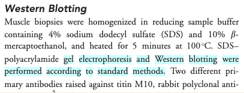
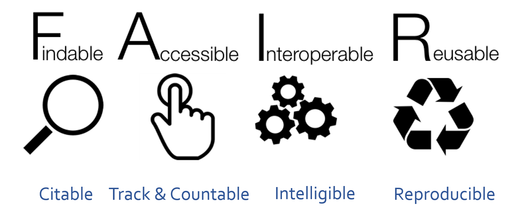

(7 min teaching)

We have seen how Open practices can benefit both scientific community as
a whole and individual practitioner.
The wide adoption of Open Access principles has resulted in an easy access
to recent biomedical publications.
Unfortunately, the same cannot be said about data and software
that accompanies those publications.

> ## What is data
>
> Although scientific data is a very broad term, we still encounter
> groups who (wrongly) believe they do not have data!
> Data does not mean Excel files with recorded measurements from a machine.
> Data also includes:
> * images, not only from microscopes
> * information about biological materials, like strain or patient details
> * biological models
> * recipes, laboratory and measurement protocols
> * scripts, analysis procedures, and custom software can also be considered data
> However, there are specific recommendations on how to deal with code.
>
{: .callout}

Let's have a look how challenging it can be to access and use
data from published biological papers.

> ## Exercise 1: Impossible protocol (4 min)
>
> You need to do a western blot to identify Titin proteins,
> the largest proteins in the body, with a molecular weight of 3,800 kDa.
> You found an antibody sold by Sigma Aldrich that has been validated
> in western blots and immunofluorescence. Sigma Aldrich lists the
> [Yu et al., 2019](https://doi.org/10.1002/acn3.50831)
> paper as reference.
>
> Find details of how to separate and transfer this large protein in
> the reference paper.
>
> * Hint 1: Methods section has a Western blot analysis subsection.  
> * Hint 2: Follow the references.  
>
> Would you say that the methods was Findable? Accessible? Reusable?
>
>> ## Solution
>>
>>  * Ref 17 will lead you to [this
>>     paper](https://doi.org/10.1002/ana.24102), which first of all is
>>     not Open Access
>>  * Access the paper through your institutions (if you can) and find
>>     the 'Western Blotting' protocol on page 232 which will show the
>>     following (Screenshot from the methods section from [Evilä et al 2014](https://doi.org/10.1002/ana.24102)):
>>  * 
>>  * "Western blotting were performed according to standard methods." -
>>     with no further reference to these standard methods, describing
>>     these methods, or supplementary material detailing these methods
>>  * This methodology is unfortunately a true dead end and we thus
>>      can't easily continue our experiments!
>>
> {: .solution}
{: .challenge}

> ## Impossible numbers
>
> [Ikram 2014](https://doi.org/10.1093/jxb/err244) paper contains data about various metabolites in
> different accessions (genotypes) of Arabidopsis plant. 
> You would like to calculate average nitrogen content in plants grown under normal and nitrogen 
> limited conditions. 
> Please calculate the average (over genotypes) nitrogen content for the two experimental conditions.
>
> * Hint 1. Data are in Supplementary data   
> * Hint 2. Search for nitrogen in paper text to identify the correct data column.  
>
>> ## Solution
>>
>> * Finding the right table and column containing the relevant data is already problematic as the headers are obscured so they need to decoded using manuscript
>> * Data in pdf table so they cannot be readily used in calculations
>> * Depending on the software used to open (and the way the pdf was created), the local machine international settings, copying the data into Excel can bring unexpected results
>>   
>> *Data needs parsing after coping to Excel*
>>   
>> *The same data copied to Excel with polish locale has been converted to dates*
>> * In general pdf tables cannot be read programaticaly from R or Python.
>> 
>>
> {: .solution}
{: .challenge}

> ## Impossible numbers
>
> Systems biologists usually require raw numerical data to build their models.
> Take a look at the following example: Try to find the numerical data behind the
> graph shown in [Figure 6](https://www.ncbi.nlm.nih.gov/pmc/articles/PMC166576/figure/F6/)
> which demonstrates changes in levels of phytochrome proteins from [Sharrock RA and Clack T, 2002](https://www.ncbi.nlm.nih.gov/pmc/articles/PMC166576/).
>
> * Hint 1: Materials and methods describe quantification procedure
> * Hint 2: Supporting Information or Supplementary Materials sections often contain data files.
>
> How easy it was?
>
>
{: .challenge}

> ## Impossible resource/link
>
> RNA-seq (transcriptomics) data is usually deposited in online repositories such as [SRA](https://www.ncbi.nlm.nih.gov/sra) or [ArrayExpress](https://www.ebi.ac.uk/arrayexpress/).
> Your task is to find the link to the repository of the raw RNA-seq data in [Li et al., Genes Dev. 2012](http://genesdev.cshlp.org/content/26/8/785.long).
> Can you find it anywhere?
>
{: .challenge}

(29 min teaching)

<!---
> ## Impossible format
>
> Sometimes raw data is shared in a proprietary format that is not easily accessible by everyone.
> Check the format in which xxx is shared in xxxx and compare it to the list of [recommended formats](https://www.ed.ac.uk/information-services/research-support/research-data-service/after/data-repository/choosing-file-formats).
> Does the resource comply with recommended guidelines?
>
{: .challenge}
-->

The above examples illustrate the typical challenges in accessing research
data and software. Firstly, data/protocols/software often do not have an identity
of their own, but only accompany a publication.
Second, they are not easily accessible or reusable, for example, all the details are inside one supporting information PDF file. Such file includes "printed" numerical table or even source code, both of which need to be "re-typed" if someone would like to use them. Data are shared in proprietary file format specific to a particular vendor and not accessible if one does not have a particular software that accompanies the equipment. Finally, data files are provided without detailed description
other than the whole article text.

In our examples, the protocol was difficult to **find** (the loops),
difficult to **access** (pay wall), and not **reusable** as it lacked the necessary details (dead-end).
In the second example the data were not **interoperable** and **reusable**
as their were only available as a figure graph.

To avoid such problems FAIR principles were designed.

After [SangyaPundir](https://commons.wikimedia.org/wiki/File:FAIR_data_principles.jpg)

> ## FAIR Principles
>
> In 2016, the [FAIR Guiding Principles for scientific data management and stewardship](https://www.nature.com/articles/sdata201618)
> were published in Scientific Data.
> The original guideline focused on "machine-actionability" -
> the ability of computer systems to operate on data with
> minimal human intervention. However, now the focus has shifted
> to making data accessible from a human perspective, and not an automated one
> (mostly due to the lack of user friendly tools that could help
> deal with standards and structured metadata).
>
> **Findable**:  Easy to find data and metadata for
> both humans and computers.
> Automatic and reliable discovery of datasets and services depends
> on machine-readable persistent identifiers (PIDs) and metadata.
>
> **Accessible**: (Meta)data should be retrievable by their identifier using
> a standardized and open communications protocol (including authentication
> and authorisation). Metadata should be available even when the data
> are no longer available.
>
> **Interoperable**: Data should be able to be combined with and used
> with other data or tools. The format of the data should be open and
> interpretable for various tools. It applies both to data and
> metadata, (meta)data should use vocabularies that follow FAIR principles.
>
> **Re-usable**: FAIR aims at optimizing the reuse of data.
> Metadata and data should be well-described so that they can be replicated
> and/or combined in different settings. The reuse of (meta)data
> should be stated with clear and accessible license(s).
>
{: .callout}

## FAIR in biological practice

#### Findable & Accessible

Deposit data to an external, reputable public repository.

Repositories provide persistent identifiers (PIDs), catalogue options,
advanced metadata searching, and download statistics. Some repositories can also host private data or provide embargo periods, meaning access to all data can be delayed.

There are general "data agnostic" repositories, for example:
* [Dryad](http://datadryad.org),
* [Zenodo](http://zenodo.org),
* [FigShare](http://figshare.com),
* [Dataverse](http://thedata.org).

Or domain specific, for example:
* [UniProt](https://www.uniprot.org/) protein data,
* [GenBank](https://www.ncbi.nlm.nih.gov/genbank/) sequence data,
* [MetaboLights](https://www.ebi.ac.uk/metabolights/) metabolomics data
* [GitHub](https://github.com/) for code.

*We will cover repositories in more details in a later episode.*

> ## What are persistent identifiers (PIDs)
>
> A persistent identifier is a long-lasting reference to a digital resource.
> Typically it has two components:
> * a service that locates the resource over time even when its location changes
> * and a unique identifier (that distinguishes the resource or concept from others).
>
> Persistent identifiers aim to solve the problem of the persistence of accessing cited resource,
> particularly in the field of academic literature. All too often, web addresses (links) changes over time
> and fail to take you to the referenced resource you expected.
>
> There are several services and technologies (schemes) that provide PIDs
> for objects (whether digital, physical or abstract).
> One of the most popular is **Digital Object Identifier [(DOI)](https://www.doi.org/)**,
> recognizable by the prefix doi.org in the web links.
> For example: [https://doi.org/10.1038/sdata.2016.18](https://doi.org/10.1038/sdata.2016.18)
> resolves to the location of the paper that describes FAIR principles.
>
> Public repositories often maintain web addresses of their content in a stable form
> which follow the convention http://repository.adress/identifier;
> these are often called permalinks.
> For well establish services, permalinks can be treated as PIDs.
>
> For example: [http://identifiers.org/SO:0000167](http://identifiers.org/SO:0000167) resolves to a page
> defining promoter role, and can be used to annotate part of a DNA sequence
> as performing such a role during transcription.
>
>
{: .callout}

#### Interoperable

* Use common file formats (can be domain specific)
* Always use .csv or .xls files for numerical data.
**Never** share data tables as word or pdf,
* Provide underlying numerical data for all plots and graphs
* Convert proprietary binary formats to the open ones.
  For example
 convert Snapgene to Genbank, microscopy multistack images to OME-TIFF

#### Reusable

1. Describe your data well / provide good metadata
    * write README file describing the data
    * user descriptive column headers for the data tables
    * tidy data tables, make them analysis friendly
    * provide as many details as possible (prepare good metadata)
    * use (meta)data formats (e.g. SBML, SBOL)
    * follow Minimum Information Standards

*Describing data well is the most challenging part of the data sharing process.
We will cover this in more detail later on.*

2. Attach license files.
Licenses explicitly declare conditions and terms by which data and software can be re-used.
Here, we recommend:
    * for data [Creative Commons Attribution (CC BY)](https://creativecommons.org/licenses/by/4.0/)
license,
    * for code a permissive open source license such
as the [MIT](https://opensource.org/licenses/MIT),
[BSD](https://opensource.org/licenses/BSD-2-Clause),
or [Apache license](http://www.apache.org/licenses/).

> ## Copyright and data
>
> Software code (the text) automatically gets the default
> copyright protection
> which prevents others from copying or modifying it.
> Only by adding the explicit licence you can permit re-use by others.
>
> Data, being factual, cannot be copyrighted. **So why, do we need a license?**
>
> While the data itself cannot be copyrighted,
> the way how it is presented can be. The extend to which it is protected needs ultimately
> to be settled by the court.
>
> The "good actors" will restrain from using your data to avoid "court" risks.
> The "bad actors" will either ignore the risk or can afford the lawyers
> fees.
>
{: .callout}

> ## Exercise 2: Example of FAIR data (4 min)
>
> Zenodo is general data repository. 
> Have a look at the dataset record with COVID-19 data:
> [https://doi.org/10.5281/zenodo.6339631](https://doi.org/10.5281/zenodo.6339631)
>
> Identify how each of F.A.I.R principles has been met.  
> *Hint: navigate to linked github record to easily access the README file*
>
>
>> ## Solution
>>
>> * (F) The dataset is identified by a PID (doi). It can be found by its ID. It has human accessible description and keywords, both suitable for discovery. 
>> * (A) Data can be downloaded using standard browser.
>> * (I) Dataset entries are in common formats: csv, R, jpg
>> * (I) Dataset is linked to publication, github record and project website
>> * (R) The record contains rich metadata in README file, including files structure and the detailed tables formats.
>> * (R) Data are released under open Creative Commons Attribution Licence
>>
> {: .solution}
{: .challenge}

> ## Exercise 2 (too)Advanced: Example of FAIR data (4 min)
> *Depending on the audience this version of the excercise may present information overload.*
>
> Uniprot is a high-quality and freely accessible resource of protein sequence 
> and functional information. Have a look at the record of the GFP protein:
> [https://www.uniprot.org/uniprot/P42212](https://www.uniprot.org/uniprot/P42212)
>
> Identify how each of F.A.I.R principles has been met.
>
> *Alternative records to check:*
> *https://www.ncbi.nlm.nih.gov/nuccore/AH002877.2 https://synbiohub.org/public/bsu/SubtilinReceiver_spaRK_separated/1*
>
>> ## Solution
>>
>> All entries are uniquely identified by a stable URL ('F'),
>> that provides access to the record in a variety of formats including
>> a web page, plain-text, FASTA, and GENBANK ('A', 'I').
>> The record contains rich metadata (‘R’) that is both human-readable (HTML) and machine-readable (text) ('I').
>> There search options that uses both record IDs and the rich metadata ('F').
>> The graphical pane shows how the data are re-usable. Metadata uses ontological
>> terms (e.g. taxonomy) and shared vocabularies (e.g. genbank features) ('I').
>> Interlinking with other databases: GenBank, Pubmed ('I', 'R') enabling automated retrieval of records and cross-referencing information.
>>
> {: .solution}
{: .challenge}

> ## Exercise 3: FAIR and You (3 min)
>
> The FAIR acronym is sometimes accompanied with the following labels:
> * Findable - Citable
> * Accessible - Trackable and countable
> * Interoperable - Intelligible
> * Reusable - Reproducible
>
> Using those labels as hints discuss how FAIR principles directly
> benefit you as the data creators.
>
>> ## Solution
>>
>> * Findable data have their own identity, so they can be easily
>> cited and secure the credits to the authors
>> * Data accessibility over the Internet using standard protocols can be
>> easily monitored (for example using Google analytics). This results in metrics
>> on data popularity or even geo-locations of data users.
>> * Interoperable data can benefit the future you, for example you will be
>> able to still read your data even when you no longer have access to the specialized,
>> vendor specific software with which you worked with them before.
>> Also the future you may not remember abreviations and ad-hoc conventions you used before
>> (Intelligible).
>> * Well documented data should contain all the details necessary to
>> reproduce the experiments, helping the future you or someone taking over
>> from you in the laboratory.
>> * Saves time and money.
>>
> {: .solution}
{: .challenge}

## FAIR vs Open Science (6 min teaching)

**FAIR does not mean Open**. Actually, FAIR guideline only requires
that the metadata record is always accessible.
For example, the existence of the data can be known (their metadata),
the data can have easy to use PID to reference them, but the actual
data files can only be downloaded after the login and authorization.

However, if data are already in the FAIR form, i.e. accessible over the internet,
in interoperable format and well documented, then it is almost
effortless to "open" the dataset and make it available to the whole public.
The data owner can do it any time when he no longer perceives oppening
as a risk.

At the same time, Open data which does not follow FAIR guidelines have
little value. If they are not well described, not in open formats then they
are not going to be re-used even if they were made "open" by posting them on some
website.

> ## Exercise 4: FAIR Quiz (5 min - run through break)
>
> Which of the following statements is true/false (T or F).
>
> * F in FAIR stands for free.
> * Only figures presenting results of statistical analysis need underlying numerical data.
> * Sharing numerical data as a .pdf in Zenodo is FAIR.
> * Sharing numerical data as an Excel file via Github is not FAIR.
> * Group website is a good place to share your data.
> * Data from failed experiments are not re-usable.
> * Data should always be converted to Excel or .csv files in order to be FAIR.
> * A DOI of a dataset helps in getting credit.
> * FAIR data are peer reviewed.
> * FAIR data accompany a publication.
>
>> ## Solution
>> * F in FAIR stands for free. F
>> * Only figures presenting results of statistical analysis need underlying numerical data. F
>> * Sharing numerical data as a .pdf in Zenodo is FAIR. F
>> * Sharing numerical data as an Excel file via Github is not FAIR. F
>> * Group website is a good place to share your data. F
>> * Data from failed experiments are not re-usable. F
>> * Data should always be converted to Excel or .csv files in order to be FAIR. F
>> * A DOI of a dataset helps in getting credit. T
>> * FAIR data are peer reviewed. F
>> * FAIR data accompany a publication. F
>>
> {: .solution}
{: .challenge}



