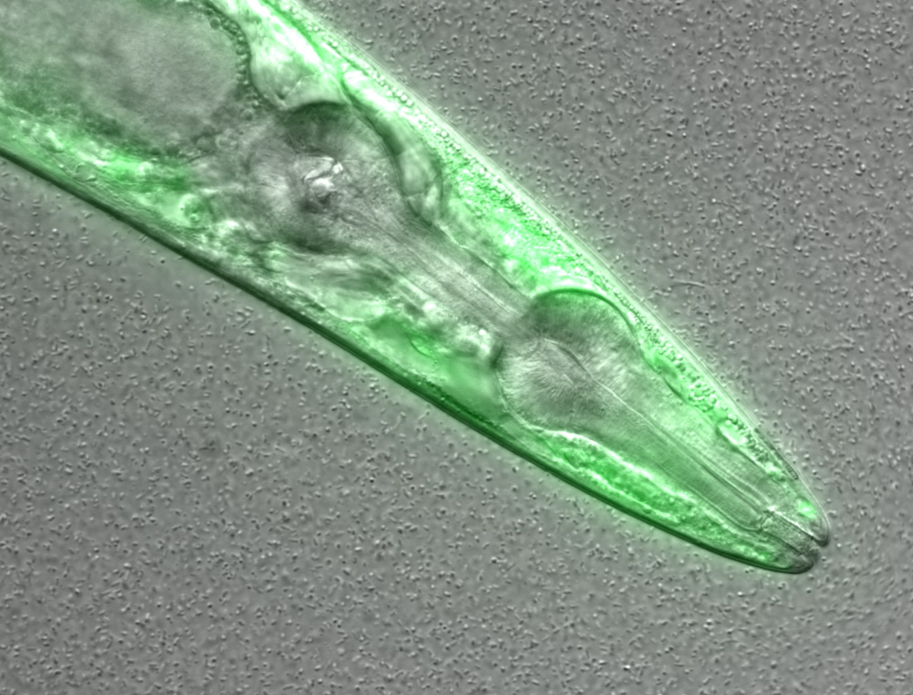
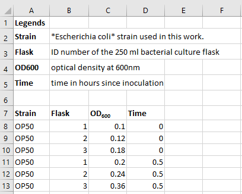
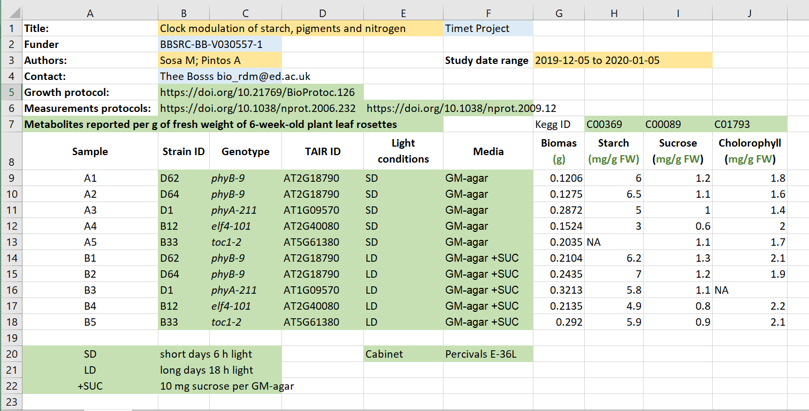
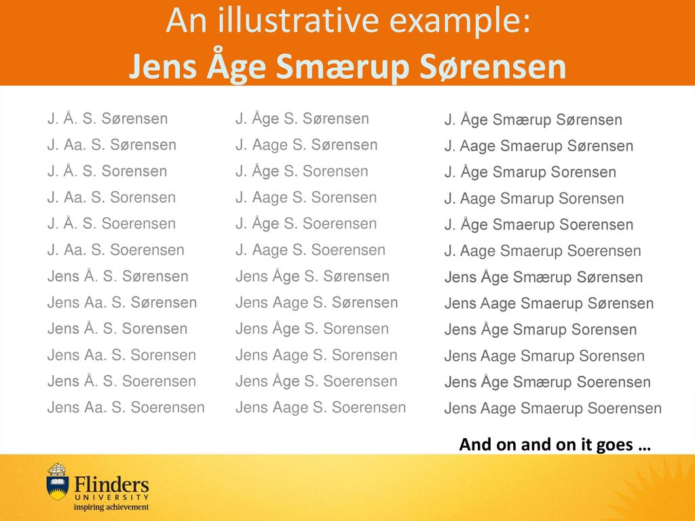

## What is (or are) metadata?

Simply put, metadata is the data about the data. Does this sound
confusing? Let's clarify: metadata is the *description of your data*. It
allows others to gain deeper understanding about your data and provides
insight for its interpretation. Hence, you should consider your metadata
as important as your data. Further, metadata plays a very important role
in making your data FAIR. It has to be continuously added to your
research data (not just at the beginning or end of your project!).
Metadata can be produced in an automated way (e.g.: when you create a
microscopy image usually the accompanying software saves metadata on it)
or manually.

<ins>Let's take a look at an example:</ins>

This is a confocal microscopy image of a *C. elegans* nematode strain used
as a proteostasis model (Pretty! Isn't it?). The image is part of the raw data
associated to [Goya et al., 2020](https://doi.org/10.1016/j.celrep.2019.12.078),
which was deposited in a [Public Omero Server](https://publicomero.bio.ed.ac.uk/webclient/?show=dataset-231).

*Figure credits: María Eugenia Goya*

.
What information **can you guess** without the associated description (metadata)?

Let's see the associated metadata to the image and the dataset to which it belongs:

> ## Image metadata
>
> Name: OP50 D10Ad_06.czi
> Image ID: 3485
> Owner: Maria Eugenia Goya
> ORCID: 0000-0002-5031-2470
>
> Acquisition Date: 2018-12-12 17:53:55
> Import Date: 2020-04-30 22:38:59
> Dimensions (XY): 1344 x 1024
> Pixels Type: uint16
> Pixels Size (XYZ) (µm): 0.16 x 0.16 x 1.00
> Z-sections/Timepoints: 56 x 1
> Channels: TL DIC, TagYFP
> ROI Count: 0
>
> Tags: time course; day 10; adults; food switching; E. coli OP50;
> NL5901; C. elegans
>
> ## Dataset metadata
>
> Name: Figure2_Figure2B
> Dataset ID:	263
> Owner: Maria Eugenia Goya
> ORCID: 0000-0002-5031-2470
>
>
> Description:
> The datasets contains a time course of α-syn aggregation in NL5901 C.
> elegans worms after a food switch at the L4 stage:
>
> E. coli OP50 to OP50
> Day 01 adults
> Day 03 adults
> Day 05 adults
> Day 07 adults
> Day 10 adults
> Day 13 adults
>
> E. coli OP50 to B. subtilis PXN21
> Day 01 adults
> Day 03 adults
> Day 05 adults
> Day 07 adults
> Day 10 adults
> Day 13 adults
>
> Images were taken at 6 developmental timepoints (D1Ad, D3Ad, D5Ad,
> D7Ad, D10Ad, D13Ad)
>
> \* Some images contain more than one nematode.
>
> Each image contains   ~30 (or more) Z-sections, 1 µmeters apart. The
> TagYFP channel is used to follow the alpha-synuclein particles. The TL
> DIC channel is used to image the whole nematode head.
>
> These images were used to construct Figure 2B of the Cell Reports
> paper (<https://doi.org/10.1016/j.celrep.2019.12.078>).
>
> Creation date: 2020-04-30 22:16:39
>
> Tags: protein aggregation; time course; E. coli OP50 to B. subtilis PXN21; food switching; E. coli OP50;
> 10.1016/j.celrep.2019.12.078; NL5901; C. elegans
{: .callout}

This is a lot of information!

## Types of metadata

According to [How to FAIR](https://howtofair.dk/) we can distinguish
between three main types of metadata:
* **Administrative metadata:** are data about a project or resource
that are relevant for managing it; for example, project/ resource owner,
principal investigator, project collaborators, funder, project period,
etc. They are usually assigned to the data, before you collect or create
them.
* **Descriptive or citation metadata:** are data about a dataset or
resource that allow people to discover and identify it; for example,
authors, title, abstract, keywords, persistent identifier, related
publications, etc.
* **Structural metadata:** are data about how a dataset or resource
came about, but also how it is internally structured. Structural
metadata describe, for example, the unit of analysis, collection method,
sampling procedure, sample size, categories, variables, etc. Structural
metadata have to be gathered by the researchers according to best
practice in their research community and will be published together with
the data.

Descriptive and structural **metadata should be added
continuously** throughout the project.

> ## Where does data end and metadata starts?
>
> What is "data" and what is "metadata" is can be a matter of
> perspective: Some researchers' metadata can be other researchers'
> data.
>
> For example, a funding body is a typical administrative metadata,
> however, it can be used to calculate numbers of public datasets per funder.
> And then used to compare effect of different funders' policies on open practices.
>
{: .callout}

> ## Identifying metadata types (3+2 minutes)
> Here we have an excel spreadsheet that contains project metadata for
> a made-up experiment of plant metabolites
> 
> *Figure credits: Tomasz Zielinski and Andrés Romanowski*
>
> In groups, identify different types of metadata (administrative,
> descriptive, structural) present in this example.
>
> > ## Solution
> > * Administrative metadata marked in blue
> > * Descriptive metadata marked in orange
> > * Structural metadata marked in green
> >
> >*Figure credits: Tomasz Zielinski and Andrés Romanowski*
> {: .solution}
{: .challenge}

## Being precise

If the metadata purpose is to help understand the data, it has
to be done in a precise and "understandable" way i.e. it has to be
interoperable. To be interoperable metadata should use
a formal, accessible, shared, and broadly applicable terms/language
for knowledge representation.

One of the easiest examples is the problem of author disambiguation.

*After [Libarary Carpentry FAIR Data](https://librarycarpentry.org/lc-fair-research/)*

> ## Open Researcher and Contributor ID (ORCID)
>
> Have you ever done a search in pubmed and found that you have
> *doppelganger*? So how can you uniquely associate something you created
> to just you and no other researcher that has the same name?
>
> [ORCID](https://orcid.org/) iD is a free, unique, persistent identifier that you own and control—forever.
> It distinguishes you from every other researcher across disciplines,
> borders, and time.
>
> ORCIDs of authors of this episode are:
> * [0000-0002-0194-5706](https://orcid.org/0000-0002-0194-5706)
> * [0000-0003-0737-2408](https://orcid.org/0000-0003-0737-2408)
>
> You can connect your iD with your professional information—affiliations,
> grants, publications, peer review, and more.
> You can use your iD to share your information with other systems,
> ensuring you get recognition for all your contributions,
> saving you time and hassle, and reducing the risk of errors.
>
> If you do not have an [ORCID](https://orcid.org/),
> you should register to get one!
>
{: .callout}

ORCID provides the registry of researchers, so they can be precisely identified.
Similarly, there are other registries that can be used to identify many
of biological concepts and entities:
* species e.g. [NCBI taxonomy](https://www.ncbi.nlm.nih.gov/Taxonomy)
* chemicals e.g. [ChEBI](https://www.ebi.ac.uk/chebi)
* proteins e.g. [UniProt](https://www.uniprot.org/)
* genes e.g. [GenBank](https://www.ncbi.nlm.nih.gov/genbank/)
* metabolic reactions, enzymes e.g [KEGG](https://www.genome.jp/kegg/)

[NCBI](https://www.ncbi.nlm.nih.gov/) or [BioPortal](https://bioportal.bioontology.org/)
are good places to start searching for a registry or a term.

> ## Public ID in action (3)
>
> Wellcome Open Research journal uses ORCID to identify authors.
> * Open one of our papers [doi.org/10.12688/wellcomeopenres.15341.2](https://doi.org/10.12688/wellcomeopenres.15341.2)
> and check how public IDs as ORCID can be used to interlink information.
> * The second metadata example (the Excel table) contains two other
> types of public IDs. Can you find them?
> Can you find the meaning behind those Ids?
>
> *If you have not done it yet, register yourself at ORCID*
>
> > ## Solution
> > ORCID is used to link to authors profiles which list their other
> > publications.
> >
> > The metadata example contains genes IDs from The Arabidopsis Information Resource
> > [TAIR](https://www.arabidopsis.org) and metabolites IDs from
> > [KEGG](https://www.genome.jp/kegg/compound/)
> >
> {: .solution}
{: .challenge}

## Adding metadata to your experiments

Good metadata are crucial for assuring re-usability of your outcomes.
Adding metadata is also very time-consuming process if done manually,
so collecting metadata should be done incrementally during your experiment.

As we saw metadata can take many forms
from as simple as including a ReadMe.txt file,
by embedding them inside the Excel files,
to using domain specific metadata standard and format.

But,
* **what to include in the metadata?**
* **what public IDs to use?**

For many assay methods and experiment types, there are defined recomendations
and guidelines called **Minimal Information Standards**.

> ## Minimal Information Standard
>
> The minimum information standard is a set of guidelines for reporting data
> derived by relevant methods in biosciences.
> If followed, it ensures that the data can be easily verified,
> analysed and clearly interpreted by the wider scientific community.
> Keeping with these recommendations also facilitates the foundation of structuralized
> databases, public repositories and development of data analysis tools.
> The individual minimum information standards are brought by the communities of cross-disciplinary
> specialists focused on the problematic of the specific method used in experimental biology.
>
> Minimum Information for Biological and Biomedical Investigations [(MIBBI)](https://fairsharing.org/collection/MIBBI)
> is the collection of the most known standards.
>
> [FAIRSharing](https://fairsharing.org/standards/) offers excellent search service
> for finding standards
>
{: .callout}

What can you do if there are no metadata standards defined for your
data / field of research?

Think about the minimum information that
someone else (from your lab or from any other lab in the world) would
need to know about your dataset to be able to work with it without any
further inputs from you.

**Think as a consumer** of your data not the producer!

> ## What to include - discussion (5+5 minutes)
>
> Think of the data you generate in your projects,
> and imagine you are going to share them.
>
> What information would another researcher need to understand or reproduce your data
> (the structural metadata)?
>
> For example, we believe that any dataset should have:
> * a name/title
> * its purpose or experimental hypothesis
>
> Write down and compare your proposals, can we find some common elements?
>
> > ## Solution
> > Some typical elements are:
> > * biological material, e.g. Spciecies, Genotypes, Tissues type, Age, Health conditions
> > * biological context, e.g. speciment growth, entrainment, samples prepartions
> > * experimental factors and conditions, e.g. drug treatments, stress factors
> > * specifics of data aquisition
> > * specifics of data processing and analysis
> >
> {: .solution}
{: .challenge}

## Metadata and FAIR guidelines
Metadata provides extreme valuable information for us and others
to be able to interpret, process, reuse and reproduce
the research data it accompanies.

Because metadata are data about data, all of the FAIR principles i.e.
Findable, Accessible, Interoperable and Reusable apply to metadata.

Ideally, metadata should not only be machine-readable, but also interoperable
so that they can interlink or reasoned about by computer systems.

> ## Tip
> What can you do if there are no metadata standards defined for your
> data / field of research?
> Think about the minimum information that
> someone else (from your lab or from any other lab in the world) would
> need to know about your dataset to be able to work with it without any
> further inputs from you.
{: .callout}

## Adding metadata to your experiments
Collecting and adding metadata to your experimental data files could take many forms. It could as simple as including a ReadMe.txt file,
or, as we saw in the previous example, including your metadata within a spreadsheet. In subsequent episodes we will see more examples in
greater detail.
For a template ReadMe.txt that you could use to include with your datasets, click here: [ReadMe.txt template](../files/readme_template_BioRDM.txt)

## Metadata and FAIR guidelines
Metadata provides valuable information for us and others to be able to interpret (and process) the research data it accompanies. Making your
data and metadata public provides an extra location for others to find your work. Even if you have published your results, the data files may
not be findable. Metadata are machine-readable, and when they have a persistent identifier, search engines can easily find them.
To be FAIR, your data (and metadata) must have a findable persistent identifier. The persistent identifier is typically assigned when a digital
resource is placed in a data repository.

> ## Metadata and FAIR guidelines - discussion (5 minutes)
>
> In groups, discuss how metadata can help the process of FAIRification.
>
{: .challenge}

> ## Attribution
>
> Content of this episode was adapted from:
> - [Metadata - FAIR data for climate sciences](https://escience-academy.github.io/Lesson-FAIR-Data-Climate/metadata/index.html).
> - [Metadata - How to FAIR](https://howtofair.dk/how-to-fair/metadata/)
> - [MIBBI](https://fairsharing.org/collection/MIBBI)
{: .callout}


