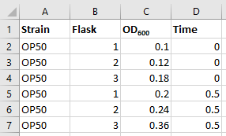

## What is (or are) metadata?
Simply put, metadata is the data about the data. Does this sound confusing? Let's clarify: metadata is the *description of your data*. It allows others
to gain deeper understanding about your data and provides insight for its interpretation. Hence, you should consider your metadata as important
as your data. Further, metadata plays a very important role in making your data FAIR. It has to be continuously added to your research data (not just at 
the beginning or end of your project!). Metadata can be produced in an automated way (e.g.: when you create a microscopy image usually the accompanying 
software saves metadata on it) or manually. 

> ## Distinguishing data from metadata
> What is “data” and what is “metadata” is thereby a matter of perspective: Some researchers’ metadata can be other researchers’ data.
> 
{: .callout}

## Types of metadata
According to [How to FAIR](https://howtofair.dk/) we can distinguish between three main types of metadata:  
* **Administrative metadata:** are data about a project or resource that are relevant for managing it; for example, project/ resource owner, principal investigator, 
project collaborators, funder, project period, etc. They are usually assigned to the data, before you collect or create them.  
* **Descriptive or citation metadata:** are data about a dataset or resource that allow people to discover and identify it; for example, authors, title, abstract, keywords,
 persistent identifier, related publications, etc.  
* **Structural metadata:** are data about how a dataset or resource came about, but also how it is internally structured. Structural metadata describe, for example, the unit
 of analysis, collection method, sampling procedure, sample size, categories, variables, etc. Structural metadata have to be gathered by the researchers according to best 
 practice in their research community and will be published together with the data. Descriptive and structural metadata should be added continuously throughout the project.

## How to include metadata with (or within) our datasets?
Including metadata to your newly produced data can be as simple as adding a 'ReadMe.txt' file or, for example, adding a header to a spreadsheet that contains
your data.

> ## Producing metadata (2 minutes)
> Have you ever done a search in pubmed and found that you have *doppelganger*? Do not worry, there is a solution to that! It is called an ORCID.
> An [ORCID](https://orcid.org/) is a unique identifier that links the papers you produced with you. Let's make use of it:
>  
> Create a tab separated text file with the following key value pairs that identifies you *unequivocally* as the data owner (2 minutes):
> Data owner: <your name>
> ORCID: <your ORCID>
>
> If you do not have an [ORCID](https://orcid.org/), please create one for this excercise.
> 
>> ## Solution
>> A possible example would be:
>>> ## ReadMe.txt
>>> Data Owner: Andrés Romanowski  
>>> ORCID: 0000-0003-0737-2408
>>> 
>> {: .source}
> {: .solution}
{: .challenge}

> ## Producing metadata 2 (13 minutes)
> Data about an experiment is frequently collected in spreadsheets, like MS Excel. Let's take a look at the following example:
> 
>
> Discuss what could possibly be misinterpreted if someone else downloaded this spreadsheet and did not have any acompanying metadata. (5 minutes)
>  
> How would you improve this? (5 minutes)
>> ## Solution
>> One possible solution would be to include the following header in the first rows of the spreadsheet:
>> A | B
>>  --- | --- |
>> Strain: | *Escherichia coli* strain used in this work.
>> Flask: | ID number of the 250 ml bacterial culture flask.
>> OD600: | optical density at 600nm.
>> Time: | time in hours since inoculation .
>> 
>> Discuss: could you think of any other metadata that could be of use here? (3 minutes)
> {: .solution}
{: .challenge}

> ## Metadata standards
> Many fields have a set of defined ways in which to structure their metadata (this ensures it is consistent among the researchers of the field, and helps with machine readibility of metadata). 
> A list of metadata standards can be found at the [The Digital Curation Center](http://www.dcc.ac.uk/resources/metadata-standards/list).
>  
> What can you do if there are no metadata standards defined for your data / field of research?
> Think about the minimum information that someone else (from your lab or from any other lab in the world) would need to know about your dataset to be able to work with it without any further
> inputs from you.
>
{: .callout}

> ## Attribution
> Content of this episode was adopted from:
> - [Metadata - FAIR data for climate sciences](https://escience-academy.github.io/Lesson-FAIR-Data-Climate/metadata/index.html).
> - [Metadata - HOWTO FAIR](https://howtofair.dk/how-to-fair/metadata/)
> - [Data Tidiness](https://datacarpentry.org/organization-genomics/01-tidiness/index.html)
{: .callout}


