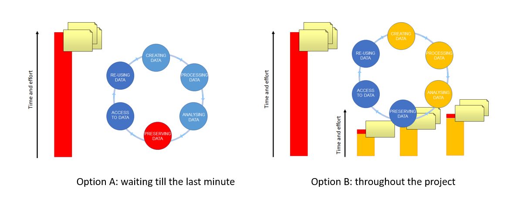

## The research data life cycle
The Research Data Life Cycle is composed of a sequential series of stages/steps in which data is produced, processed and shared.
The arrows between circles represent the transitions that occur in research as work is finished and passed to the next stage/step. Research institutions need to support researcher across each stage of the research data life cycle and to facilitate the transition between stages/steps for maximum use and impact.
  

*Figure credits: Tomasz Zielinski*

> ## Challenge (2 minutes)
> Where would you say the following actions belong in the Research Data Life Cycle?
> * performing statistical analysis on an experiment's results.
> * sharing my datasets through a general repository, such as Zenodo.
> * conversion of raw data into usable data.
> * obtaining data from an experiment.
> * downloading a dataset that will be useful for my research.
> * saving my data in a resilient data storage with nightly backups, provided by my Institute.
>
> > ## Solution
> > * performing statistical analysis on an experiment's results.[ANALYSING DATA]
> > * sharing my datasets through a general repository, such as Zenodo.[PRESERVING DATA / ACCESS TO DATA]
> > * conversion of raw data into usable data [PROCESSING DATA]
> > * obtaining data from an experiment.[CREATING DATA]
> > * downloading a dataset that will be useful for my research. [RE-USING DATA]
> > * saving my data in a resilient data storage with nightly backups, provided by my Institute. [PRESERVING DATA]
> {: .solution}
{: .challenge}

> ## Challenge (2 minutes)
> In pairs, discuss how this process may help in making your data FAIR:
> - How does it help in making it Findable?
> - How does it help in making it Accessible?
> - How does it help in making it Interoperable?
> - How does it help in making it Re-usable?
{: .challenge}

## Data management is a continuous process
When should I engage in data management?
* Data management should be done throughout the duration of your project.  
* If you wait till the end, it will take a massive effort on your side and will be more of a burden than a benefit.  
* Taking the time to do effective data management will help you understand your data better and make it easier to find it when you need it (for example when you need to write a manuscript or a thesis!).  

*Figure credits: Tomasz Zielinski and Andrés Romanowski*

## Plan ahead: data management plans (DMPs)
A Data Management Plan is about PLANning! Funders are increasingly requiring that you present a DMP together with your grant applications. Some grad schools are also asking their
PhD students to prepair a DMP for their PhD project.  

*Figure credits: Tomasz Zielinski and Andrés Romanowski*

The DMP's purpose is to make you think about your data before you produce it. It must show that you were thinking about what will happen with your data during and after the project.
You should think about:
- how you will store the data  
- how you will organize and describe your data  
- how you will grant access to your data  
- how you will share your data  
- how you will preserve your data  
- how much it will all cost  

> ## Challenge (2 minutes)
> In pairs, discuss how writing a DMP would help planning how to make your data FAIR.
{: .challenge}

The benefits of writing a DMP include:
- finding and understanding your data when needed
- avoiding unnecessary duplication of data
- documenting your data to ensure ongoing access and continuity when you or other colleagues depart or new reseach staff start
- validating your published results
- ensuring your research is visible and has impact
- getting credit when others cite your work
- sharing your data, leading to collaboration and advances in research
- complying with research funder mandates 
 
> ## Challenge (10 minutes)
> Working in pairs, write a short DMP for one of your last papers (or projects).
> Your DMP should contain the following three sections:
>   
> 1. What type of data you will acquire during the research
> Please describe the type of data you will generate (for example ‘flow cytometry data’) as well as the type of files these data will be stored under (include the meta data as well). Estimate the size of your data.
>   
> 2. How you will store the date 
> Please describe how you will store/organize or document the data during the duration of the project
>   
> 3. How you will share the data 
> Please describe the strategies for data sharing, licensing and access information.
>
{: .challenge}

> ## DMP Online
> [DMP Online](https://dmponline.dcc.ac.uk/) is a UK tool that is available via subscription to many UK Universities and Institutions. It contains DMP templates
> for the different funders requirements and information on how to fill each section. Whenever you need to write your next DMP, it is highly available to check
> if this resource is available to you.
> Additionally, many Universities may offer help and advise for your DMP. For example, [the BioRDM Team](https://www.wiki.ed.ac.uk/display/RDMS/Research+Data+Management+SynthSys+%28f1sysrdm%29+Home)
> of the School of Biological Sciences of The University of Edinburgh offers free advice on how to write a DMP to UoE researchers.
{: .callout}

> ## Attribution
> Content of this episode was adapted after:
> - [Data Management Plans - UoE BioRDM wiki](https://www.wiki.ed.ac.uk/display/RDMS/Data+Management+Plans).
> - [Benefits of writing a DMP - UoE RDS](https://www.ed.ac.uk/information-services/research-support/research-data-service/before/benefits-of-writing-a-dmp).
{: .callout}


