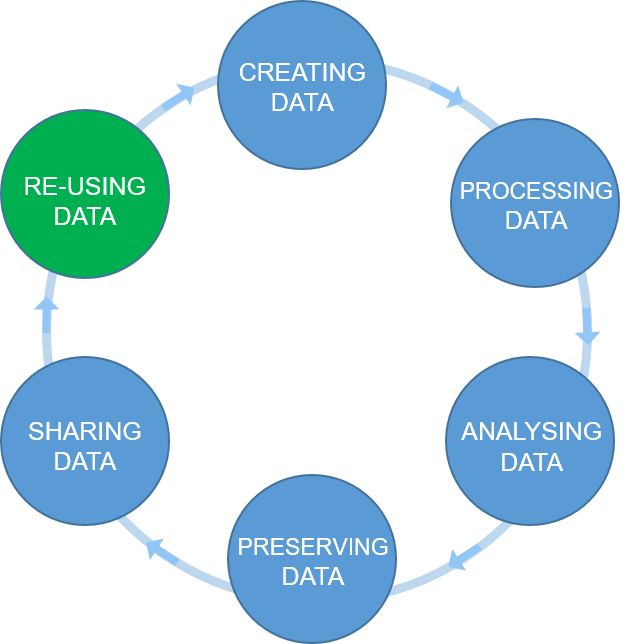
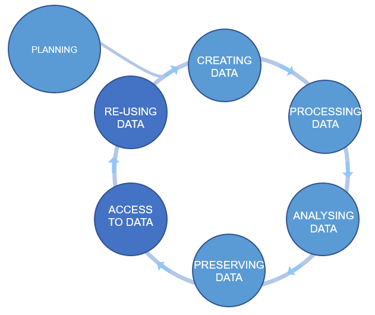

## The research data life cycle
The Research Data Life Cycle is composed of a sequential series of stages/steps in which data is produced,
processed and shared.
The arrows between circles represent the transitions that occur in research
as work is finished and passed to the next stage/step.
The re-use is the driving force of the cycle, cause as if you (or others) were
not going to use the data you would not need to store it or even process it.

*Figure credits: Tomasz Zielinski*

## Data management is a continuous process
Data management should be done throughout the duration of your project.
If you wait till the end, it will take a massive effort on your side and will be more of a burden than a benefit.

There are many actions/steps which you can take during your research workflow
which would make it easier to share your data in a **Findable, Accessible,
Interoperable and Reusable** way, while, helping
you in your day to day activities.

> ## Challenge (4 + 4 minutes)
> Where would you say the following actions belong in the Research Data Life Cycle?
> How do they help in achieving FAIR principles?
>
> * clarify usage rights
> * give credit through citations
> * use open source software
> * attach PID to your data
> * attach descriptive metadata
> * produce standard metadata
> * backup your data
> * create figures and plots in python/R
> * organize your files in folders
> * select data repository
> * add open licence
> * link publications, data and methods
> * create a template for assay description
> * use institutional repositories
> * use controlled vocabularies
> * convert numerical data to csv
> * track versions of files
> * performing statistical analysis
> * deposit datasets to Zenodo/Dryad
> * record experiment details in Electronic Lab Notebook
> * use github for your code
> * ask someone to revise your project structure
> * reformat and clean data tables
> * use a Minimal Information Standard
> * use PID in data description
> * download a dataset
> * link to UniProt or GenBank records
>
> > ## Solution
> > Actually many of the above steps can be taken throughout the data life cycle.
> >
> {: .solution}
{: .challenge}

## Plan ahead: data management plans (DMPs)
A good data management is about PLANning!

The (Data Management Plan) DMP's purpose is to make you think about your data
before you even start the experiments.
It should show that you are thinking about what will happen
with your data during and after the project. Which of the actions
mentioned above you will take and how you will execute them. Finally,
how you are going to achieve FAIR.

*Figure credits: Tomasz Zieliński and Andrés Romanowski*

You should think about:
- how you will store the data
- how you will organize and describe your data
- how you will grant access to your data
- how you will share your data
- how you will preserve your data
- how others can use your data
- how much it will all cost

Most of the funders require that you present a DMP together with your grant applications.
Some institutions ask eve their PhD students to prepare a DMP for their PhD project.

You should think how you are going to manage your data (our outputs, in general)
for each of your projects (or even individual assay types). For individual project
the main focus should be on:
**what data will be produced, how they will be stored
and organized, how you are going to describe them and track them**.
For example what file formats will be generated, how you are going to
name your files, and how you will link it to your laboratory notes.

For grant applications, DMP tend to be less technical, for example no need
to discuss folder structures, but, they should emphasize the **data safety
(as preservation and access), data longevity, sharing, discovery and re-use**.

> ## DMP Online
> [DMP Online](https://dmponline.dcc.ac.uk/) is a UK tool that is available via subscription to many UK Universities and Institutions. It contains DMP templates
> for the different funders requirements and information on how to fill each section.
> Whenever you need to write DMP for a grant application, check
> if this resource is available to you.
>
> Additionally, your own Institutions may have resources to help with your DMP.
>
{: .callout}

> ## Challenge (given as homework but starts in class 5 minutes)
> Working in pairs, think of your last paper (or project).
> Pretend that you have a joined project that combines the outputs of both your papers/projects.
>
> Write a short DMP this joined project.
>
> Your DMP should contain the following three sections:
>
> 1. What data you will acquire during the project.
> Please describe the type of data you will generate
> (for example ‘flow cytometry data’) as well as file formats and data volume.
> these data will be stored under (include the meta data as well). Estimate the size of your data.
>
> 2. How you will store the date
> Please describe how you will store and organize your data,
> what metadata will you capture in a what form.
> Tell how you or document the data during the duration of the project
>
> 3. How you will share the data
> Please describe the strategies for data sharing, licensing and access information.
>
> > ## Solution
> > An example DMP can look like:
> >
> > (1) The project will generate a combination of qualitative and quantitative data
> > derived from phenotyping, LC/MS metabolomics,
> > and general molecular biology techniques.
> >
> > The main data types and their formats are:
> > *	Phenotyping images (tiff)
> > *	Time-series / Numerical data (Excel)
> > *	MS Metabolomics (mzML)
> > *	processing scripts (Python, R)
> >
> > We envisage the project will generate a total of 4 Tb data.
> >
> > (2) The instrument specific raw data will be converted into the open formats mentioned above.
> > Daily experimental work will be recorded using an electronic lab notebook (Benchling).
> > We will use ISA templates from MetaboLights for MS data.
> >
> > All the research data will be stored using the University file system.
> > This is a high quality storage with guaranteed backup.
> > Scripts/codes will be stored under version control using GitHun.
> >
> > (3) Metabolomics data will be made available through MetaboLights (https://www.ebi.ac.uk/metabolights/)
> > repository. The remaining datasets will be made available through Zenodo.
> > The data will be released no later than a year after the project ends.
> > All data will be made available under CC-BY and the code under MIT licensing.
> >
> {: .solution}
{: .challenge}

> ## Attribution
> Content of this episode was adapted after:
> - [Data Management Plans - UoE BioRDM wiki](https://www.wiki.ed.ac.uk/display/RDMS/Data+Management+Plans).
> - [Benefits of writing a DMP - UoE RDS](https://www.ed.ac.uk/information-services/research-support/research-data-service/before/benefits-of-writing-a-dmp).
{: .callout}


