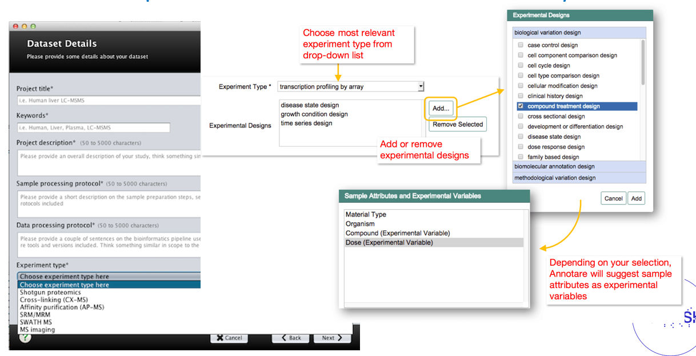

(16 min teaching)

## Being precise

If the metadata purpose is to help understand the data, it has
to be done in a precise and "understandable" way i.e. it has to be
interoperable. To be interoperable metadata should use
a ***formal, accessible, shared, and broadly applicable terms/language***
for knowledge representation.

One of the easiest examples is the problem of author disambiguation.

*After [Libarary Carpentry FAIR Data](https://librarycarpentry.org/lc-fair-research/)*

> ## Open Researcher and Contributor ID (ORCID)
>
> Have you ever searched yourself in pubmed and found that you have a
> *doppelganger*? So how can you uniquely associate something you created
> to just yourself and no other researcher with the same name?
>
> [ORCID](https://orcid.org/) is a free, unique, persistent identifier that you own and control—forever.
> It distinguishes you from every other researcher across disciplines,
> borders, and time.
>
> ORCIDs of authors of this episode are:
> * [0000-0002-0194-5706](https://orcid.org/0000-0002-0194-5706)
> * [0000-0003-0737-2408](https://orcid.org/0000-0003-0737-2408)
>
> You can connect your iD with your professional information—affiliations,
> grants, publications, peer review, and more.
> You can use your iD to share your information with other systems,
> ensuring you get recognition for all your contributions,
> saving you time and hassle, and reducing the risk of errors.
>
> If you do not have an [ORCID](https://orcid.org/),
> you should register to get one!
>
{: .callout}

> ## Exercise 1: Public ID in action (3 min)
>
> The Wellcome Open Research journal uses ORCID to identify authors.
> * Open one of our papers [doi.org/10.12688/wellcomeopenres.15341.2](https://doi.org/10.12688/wellcomeopenres.15341.2)
> and have a look how public IDs such as ORCID can be used to interlink information.
>
> * If you have not done so yet, register yourself at ORCID*
>
> > ## Solution
> > ORCID is used to link to authors profiles which list their other
> > publications.
> {: .solution}
{: .challenge}

ORCID provides the registry of researchers, so they can be precisely identified.
Similarly, there are other registries that can be used to identify many
of biological concepts and entities:
* species e.g. [NCBI taxonomy](https://www.ncbi.nlm.nih.gov/Taxonomy)
* chemicals e.g. [ChEBI](https://www.ebi.ac.uk/chebi)
* proteins e.g. [UniProt](https://www.uniprot.org/)
* genes e.g. [GenBank](https://www.ncbi.nlm.nih.gov/genbank/)
* metabolic reactions, enzymes e.g [KEGG](https://www.genome.jp/kegg/)

[BioPortal](https://bioportal.bioontology.org/) or
[NCBI](https://www.ncbi.nlm.nih.gov/)  
are good places to start searching for a registry or a term.

> ## Exercise 2: Public ID in action 2 (3 min)
> * The second metadata example (the Excel table):
> contains two other types of public IDs.  
> 
> *Figure credits: Tomasz Zielinski and Andrés Romanowski*
>   
> 	- Can you find the public IDs?
> 	- Can you find the meaning behind those Ids?
>
>
> > ## Solution
> > The metadata example contains genes IDs from The Arabidopsis Information Resource
> > [TAIR](https://www.arabidopsis.org) and metabolites IDs from
> > [KEGG](https://www.genome.jp/kegg/compound/)
> >
> {: .solution}
{: .challenge}

## Disambiguation (7 min teaching)

In academic disciplines we quickly run into problems of naming standards e.g.:
  
* Escherichia coli
* EColi
* E. coli
* E. Coli
* Kanamycin A
* Kanamycin
* Kanam.
* Kan. 

In order to prevent such ambiguities applications provide interface that constraints
users to pre-defined options, it controls the available vocabulary.

*Example of graphical user interfaces with controlled vocabularies*

> ## Controlled Vocabulary
>
> **Definition:** Any closed prescribed ***list*** of terms
>
> **Key Features:**
> * Terms are not usually defined
> * Relationships between the terms are not usually defined
> * the simplest form is a list
>
> **Example:**
> * E. coli
> * Drosophila melanogaster
> * Homo sapiens
> * Mus musculus
> * Salmonella
{: .callout}

Use of controlled vocabulary (a list) can be organised hierarchically into a taxonomy, a system we know mostly from our species taxonomy.

> ## Taxonomy
>
> **Definition:** Any controlled vocabulary that is arranged in a ***hierarchy***
>
> **Key Features:**
> * Terms are not usually defined
> * Relationships between the terms are not usually defined
> * Terms are arranged in a hierarchy
>
> **Example:**
> * Bacteria
> * * E. coli
> * * Salmonella
> * Eucariota
> * * Mammalia
> * * * Homo sapiens
> * * * Mus musculus
> * Insecta
> * * Drosophila melanogaster
{: .callout}

Ontologies add a further dimension to controlled vocabularies and taxonomy. They allow us to conceptualise relationships between the established hierarchy which helps with more sophisticated data queries and metadata searches.

> ## Ontology
>
> **Definition:** A formal ***conceptualisation*** of a specified domain
>
> **Key Features:**
> * Terms are DEFINED
> * Relationships between the terms are DEFINED, allowing logical inference and sophisticated data queries
> * Terms are arranged in a hierarchy
> * expressed in a knowledge representation language such as RDFS, OBO, or OWL
>
> **Example:**
> * Bacteria
> * * E. coli
> * * Salmonella
> * Eucariota --- has_part ---> nucleas
> * * Mammalia --- has_part ---> placenta
> * * * Homo sapiens
> * * * Mus musculus
> * Insecta
> * * Drosophila melanogaster
>
>
{: .callout}  

Ontologies represent a standardised, formal naming system and define categories, properties and relationships between data. Ontologies allow to describe properties of a subject area and how they are related (e.g. taxonomy). 

 
Ontologies allows automatic reasoning about the data, using the relations between the described terms. For example, in the picture above we can "deduce" that **hippocampal astrocyte**:
* it is type of cell as it one of its predecessor in the knowledge tree is **cell (CL_0000000)** 
* it is located in the **brain (UBERON_000955)**
* it can perform **axon regeneration (GO_0031103)** 

We could follow the term *axon regeneration* to find its definition and what it means, to have a better understanding of *hippocampal astrocyte*.

Ontologies are crucial for aggregation of information and finding suitable data.
Imagine you are interested in gene expersions in glial cells. Using a free text search you would need to hope that data from astrocytes will be also tagged as glial cell, or you would need to specify all suptypes of glial cells like oligodendrocytes astrocytes.
Ontologies permits to automatically expands such searches that they contain suitable domain. 

The above figure presents also another aspect of using ontologies. The terms are often referred to as:  
**PREFIX_ID**  e.g. CL_0002604  
Prefix (CL, UB, UBERON, GO) will identify the ontology which defined the term ([Cell Ontology](https://obofoundry.org/ontology/cl.html) for CL).  
ID refers to particular term in the ontology.

Ontologies are encoded in standard, interoperable formats, which permitted creation of re-usable interfaces to access the described terms or browsing different ontologies. For example: https://bioportal.bioontology.org/](https://bioportal.bioontology.org/) permits searching for suitable terms definitions in hundreds of ontologies.

[Obo foundry](http://www.obofoundry.org/) is another useful tool that lists recommended ontologies.

> ## Exercise 3: Exploring ontologies (with instructor)
> 
> Check the example of ontology records:
> * [oocyte](https://bioportal.bioontology.org/ontologies/ZFA/?p=classes&conceptid=http%3A%2F%2Fpurl.obolibrary.org%2Fobo%2FZFA_0001109#details)
> * [microglial cell](https://bioportal.bioontology.org/ontologies/CL?p=classes&conceptid=CL:0000129#details)
> * [promoter](https://bioportal.bioontology.org/ontologies/SO?p=classes&conceptid=http://purl.obolibrary.org/obo/SO_0000167#details)
> 
> Check what type of information is available, explore the terms hierarchy, the visualization, the interlinked terms, mapping between different ontologies.
>
{: .challenge}
 

> ## Exercise 4: Ontology tests
>
> 1.	The prefix CL stands for:
> a)	Class ontology:
> b)	Cell ontology:
> c)	Cell line ontology
> 
> 2.	The recommended ontology for chemical compounds is:
> a)	cheminf
> b)	chmo
> c)	chebi
> 
> 3.	Which terms captures both Alzheimer’s and Huntington's diseases
> a)	DOID_680
> b)	DOID_1289
> c)	DOID_0060090 
>
>> ## Solution
>> 3 b (hint try to see the tree in bioportal)
>>
> {: .solution}
{: .challenge}

> ## Attribution
>
> Content of this episode was adapted from:
> * BD2K Open Educational Resources: BDK14 Ontologies 101 [Nicole Vasilevsky](https://github.com/OHSUBD2K/BDK14-Ontologies-101)
>
{: .callout}


