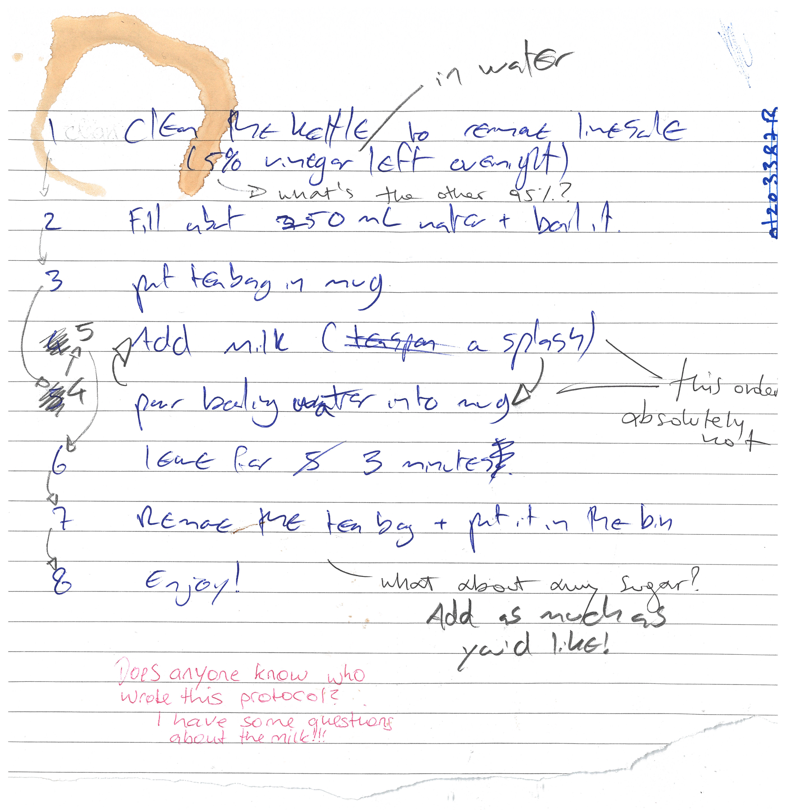

## Before we start...
Before we start this session on good record keeping, it might be a good idea to make ourselves cup of tea. Here's a peer-reviewed protocol for making tea:

*Figure credits: Ines Boehm and Ben Thomas*  

## Differences between analog and record keeping
How did you find making your cup of tea from the above protocol?
As you could see, one scientist put milk in before boiling water, another one put boiling water in before milk. Another couldn't find which type of milk was used. Whilst the steps can be followed to produce a cup of tea, the teas can vary wildly. Slight variations are acceptable, but such as in an experiment, it is *more important that steps can be repeated correctly* so that others can do the same.

Here is the same protocol typed out on [protocol.io](https://dx.doi.org/10.17504/protocols.io.buhknt4w). Which do you find easier to follow?

Although digital protocols are the better of the two, analogue protocols certainly have their place. For example, it is often easier to make notes on analogue protocols which you can return to later. Additionally, your working environment may make it too risky to bring expensive technology (just in case), whereas pen and paper can be fine. In cases like these, a hybrid system is often best - where analogue notes are digitized. This can be the best of both worlds.

> ## Challenge (5 minutes)
> What are advantages and disadvantages of traditional analog records vs. digital records? Try to find at least a handful of advantages and disadvantages for each. With all of these, which system do you think is most advantageous?
>> ## Solution
>> **Advantages of traditional analog records**
>> * Ability to directly draw on your records
>> * works regardless of internet/power access
>>
>> **Disadvantages of traditional analog records**
>> * can be lost and/or damaged (not Findable or Accessible)
>> * only in one location at any time (not Findable or Accessible)
>> * handwriting can make it less intelligible
>> * harder to edit/move elements around smoothly (not Interoperable)
>> * can’t store most data types (e.g. imaging data) in a useable way (not Reusable)
>>
>> **Advantages of digital records**
>> * Intelligible: can smoothly and easily move elements around to edit it
>> * Findable and Accessible: can be shared instantly anywhere around the world, with anyone 
>> * Interoperable: can be easily commented on by anyone anywhere
>> * doesn’t take up physical space (no record rooms/folders)
>> * regular backups mean it won't be lost
>> * Reusable: version controls mean changes can easily be tracked 
>> * Reusable: can store protocols directly with other supporting data types (e.g. video explanations)
>> * can you think of more? 
>>
>> **Disadvantages of digital records**
>> * dependent on internet access and power (not Accessible)
>> * some digital record keeping services charge a fee
>> * risk of corruption if data is not backed up (either yourself or by the service used - not Reusable)
> {: .solution}
{: .challenge}

## Why do we need to keep good quality records?
Good scientific practice includes good record keeping, which ensures not only transparency and reproducibility, but also accountability. One prime example of why this is necessary is the recent data scandal surrounding [Novartis' FDA approved gene therapy](https://www.biopharmadive.com/news/novartis-gene-therapy-application-contained-manipulated-data-fda-says/560346/) Zolgensma, for the fatal childhood motor neuron disease Spinal Muscular Atrophy (the most expensive treatment ever approved).
Novartis submitted manipulated data, showing that the comparison of two versions of Zolgensma in Phase 1 and Phase 3 testing had similar therapeutic activity. 
How can we prevent the occurrence of data manipulation such as this in the future, or how can we as a research community implement practices to make it easier to find manipulated records? FAIR record keeping, for example version control can help, as it shows what changes have been made when in electronic laboratory notebooks (ELNs), which will make it difficult to manipulate results such as this without leaving a trace.

In order to avoid data mismanagement and such unexplained discrepancies, it is imperative to keep dated, accurate, complete and intelligible records of our experiments and the protocols we use. This means they should include enough detail for others to reproduce under ideally the same conditions. You are, legally (!!) the one responsible for your records, not your colleague, or your PI.

>## What designates a good record?
>Both protocols and laboratory records need to be detailed and kept accurate and complete. They should be accessible (physically and/or electronically) to others both short and long term. Regular back-ups on a cloud and physical hard-drive are necessary to ensure appropriate archiving. All your records should be kept in compliance with departmental, institutional, and other regulatory requirements, with special care given to human and animal research records. A few common guidelines of good record keeping for protocols and laboratory notebooks are the following:
>
> **Protocols**
> * who thought of the protocol if not you
> * complete and detailed instructions describing why and how to do an experiment
> * what special materials and instruments are being used and where they were obtained
> * health and safety advice and how to dispose of waste
> * allow repetition of your procedures and studies by yourself and others
>
> **Laboratory Notebooks**
> * contain all relevant details (what, when why and how you did it)
> * who you are (the person creating the record)
> * what project(s) is the record part of
> * information on LOT numbers and batch numbers of cells and antibodies used
> * what happened and what did not happen (data, including images)
> * how you manipulated and analysed the results
> * your interpretation (and the interpretations of others if important) and next steps in the project based on these results
> * should be well organised for ease of navigation (indexed, labelled, catalogued)
> * accurate and complete: include all irginal data and important study details (metadata) and successful and unsuccessful studies
{: .callout}
  
## Why do we want to keep FAIR records?
Focusing on FAIR this keeps our records Findable, Accessible, Interoperable/Intelligible as well as Re-usable. Accessibility that allows better reuse increases our citations and visibility in the field, digital record keeping increases the legibility of notes and provenance (tracking of dates and origins of work) allow for better reproducibility which we have discussed in the previous lesson. Additionally, greater accessibility affords accountability to the original creator of the work.
We will now show you how easy it is to share records once they are online, and address some benefits that new repositories such as electronic lab notebooks (ELNs) or online protocols have. There are multiple repo's for ELNs and online protocols. We will discuss two free options that are easy to use: [Benchling](https://www.benchling.com/) and [procols.io](https://www.protocols.io/welcome) 
If you have not created accounts yet for both of them, please do so now as you will need them for the following exercises.

## How records become FAIR
### Electronic lab notebooks
By now you should be familiar with the concept of why digital record keeping is important, as this is ultimately more reproducible. It is self-explanatory that handwritten notes and laboratory notebook entries take more time to search when looking for an entry. Electronic lab notebooks allow organisation by project, and the search function, or filters, can quickly find what we are looking for. We will now show how to reuse a lab entry that has already been created by someone else. 

> ## ELN excercise (5 minutes):
> To highlight how easy it is to reuse protocols someone else has used in their lab entry, integrate these into your electronic lab notebooks, and export these for e.g. printing we will be looking at the following [Benchling lab entry, making Breakfast](https://benchling.com/s/etr-SY8fi7L8ZIDSMCLCf92o).
> ~~~
> ### Re-use a published lab entry
> 1. First within your own workspace click the big '+' (Create Project) right next to Projects in your Benchling workspace
> 2. Call the project 'Breakfast', and add an appropriate description, click 'Create project'
> 3. Click on the above 'Benchling lab entry' link bringing you to the public lab entry 'Eggs Florentine in Portobello Mushrooms'.
> 4. Select the clock symbol on the right hand side underneath Share: Now you can see the history of the entry and changes that have previously been made to the document with a timestamp. If someone had tried to 'manipulate' data, you would be able to see this here. You also see the owner of the document.
> 5. Click 'Clone from version'
> 6. Select the 'Breakfast' folder to clone it to
> {: .source}
{: .challenge}

With your newly set up lab entry, play around with it to explore the interface. Add or remove some text, use the tool to embed a picture etc... You can add text beside the image to 'annotate' this appropriately for example. Explore the various things you can interact with to get an understanding of the interface on Benchling.
 
> ## Adapting a protocol to your needs (6 minutes)
> 1. You have now accessed a digital record and want to reuse it to make your own breakfast. To show how reusable digital recors are we will first navigate through the cloned file you made in your project.
> 2. Navigate to your Project 'Breakfast', you can tell you are in your Project, if your initials show in a red circle next to entries in the side bar. You should see the lab entry 'Eggs Florentine in Portobello Mushrooms', and the top bar above the title and toolbar should read 'Tea', 'Portobello Mushrooms and Spinach', 'Poached Egg and Hollandaise Sauce', 'Add Protocol', 'Notes', and 'Metadata'.
> 3. Click through those tabs and you will see that in your notes you have your lab entry describing how breakfast was made with embedded graphics and a shopping list and current prices. The other three tabs describe the protocols that were used, and you can add additional protocols with the 'add protocol' tab. We want you to adapt the 'Tea' protocol to suit your ingredients and methods.
> 4. Once you have made appropriate changes in the Tea protocol, you should consider changing the order in which the breakfast and tea are made.
> 5. Once you have made all suggested change have a look at the history of the record (clock button), you can see the changes you have recently made, and you can see it still relates to the original document. It tells you what record it has been cloned from and when.
> 6. Click the link to the original record. As you can see digital record keeping allows provenance, crediting the original author, but also allowing you to keep track of your sources.
> 7. Navigate back to your lab entry in your project (your initials are a sign that you are in the right place).
> {: .source}
{: .challenge}

You hopefully should have set your tea making protocol up so that it's just the way you like it. Moreover, it should have been easy to make the changes to the protocol. Looking at the history of the record allows you to see the original protocol from which you adapted, and linked your adaptation.

> ## How easy it is to share your record (4 minutes)
> 1. Click the info icon on the right hand side underneath the clock symbol you used previously and select 'Export entry'
> 2. Your export is now running, you will receive an email when the export is complete
> 3. Click the link in the email to download your protocol as a .zip
> 4. Unzip the file and in your own time, print the protocol if you want to use the recipe in the kitchen, or share it with friends.
> 5. You can share .pdf versions, or click Share and generate a Share link of your lab entry. This makes your record interoperable as many users across many platforms across the world can access your entry if you make it public and share it on for example social media. If there is no IT access present, you always have the option to print the .pdf copy.
> ~~~
> {: .source}
{: .challenge}

Now that you have your export you can easily share it with others and use it yourself elsewhere, while your digital record (and links to the original record) are maintained online. You can share the PDF that you have exported with others (or print it and store it the lab/workspace), or link them to your digital record, allowing them to make further changes if you wish.

### Electronic Protocols
As you could see, Benchling has an integrated platform for protocols. But there are other repositories, such as protocols.io that we briefly mentioned beforehand, which have been developed to help make protocols FAIR. One can publish protocols with a DOI which has many benefits that we discussed in the previous lesson. Another strength is, that you can create a protocol, fork the original protocol if your lab started implementing small changes, and retain **both** versions that you can cite in your publications or share with your collaborators. 

> ## Adapt public protocols and retain provenance (10 minutes)
> To copy protocols from protocols.io, edit them and export them as a .pdf there are a few simple steps to follow. We will be using the [making a cup of tea protocol](https://dx.doi.org/10.17504/protocols.io.buhknt4w).
> ~~~
> # Fork the protocol, preserving the original for crediting
> 1. Open the link to the above protocol, as you can see we have assigned it its own DOI
> 2. First click on Metrics: Because we are FAIR, this shows you how how many views over time this protocol has had, how many exports, how many individual steps it involves and how many times it has been forked.
> 3. Now click on the downwards arrow next to the title
> 4. Select 'Copy/Fork' and click 'make a fork'
> 5. Select the Folder you want the protocol to be forked to and click 'continue'
> 6. Your fork of "How to make a cup of tea" is ready now, click 'edit new fork'
> 7. On the right hand tool bar, the clock icon, shows you the history of the protocol (as before in Benchling). Currently you should see no history as you have not made changes.
>
> # Edit the forked protocol
> 1. Go to 'Materials' in the top tool-bar: add or edit materials according to your preferences, e.g. change full-fat milk to oat-milk, or add honey, lemon etc
> 2. Go to 'Steps' in the top tool-bar: edit the protocol according to your preferences
> 3. You can edit the 'Description' and 'Guidelines & Warnings' if you would like to
> 4. As soon as you change anything, the timestamp and where in the protocol this change was made appears in the history.
> 5. Click 'View', you will now see the reader view of your protocol. It clearly states underneath the title 'Forked from How to make a cup of tea' and the original protocol is linked. This allows clear identification of your source.
> 6. Click 'Edit'
>
> # Optional: Export the forked protocol
> 1. Click 'More' in the top tool-bar, select 'Export' > 'PDF' > 'To your computer' and click export (leave selections blank)
> ~~~
> {: .source}
{: .challenge}

Now, if you go back to the original protocols.io protocol that you have forked from, and click on metrics, you will see how that views have increased. Additionally, if you click on 'Forks', it will show you that there are a multitude of private forks and if you click on one of these forks, e.g. 'Cup of tea (polish way)' you will be taken to the protocol. A particular perk of this is accessibility and accompanying accountability to the original creator of the work. 

## How to choose the right platform?
There are more than a 100 platforms that provide services to host electronic lab notebooks or protocols, therefore it can seem quite daunting trying to find the right platform. There is some advice we can offer when looking for the right service. 
* Make sure they are in compliance with departmental, institutional, and other regulatory and legal requirements (including where data is geographically located, and which types of data can and cannot be stored). 
* You want an acceptable pricing model (is it free?), check if your institution has a subscription to any.
* What is the longevity of the ELN (is it a brand new ELN, or has it been established for a while now, i.e. is there a risk of the ELN folding & data being lost?).
* What is the ability to share & export entries, experience of colleagues, availability of support, integration with other relevant platforms (e.g. dropbox), and the potential for use with mobile devices if required?
* What is the user interface like? Does it feel intuitive or does it take you days to find what you are looking for. 
* Check for operating system compatibility and real time collaboration. 
* Preferably it should be Open Source.

The BioRDM team has put together a comprehensive summary of [ELNs on the University of Edinburgh Wiki](https://www.wiki.ed.ac.uk/pages/viewpage.action?pageId=463750271) where they test-ran a handful of ELNs for you so you can make a more informed choice.

It is always best to use a free version or trial version to test an ELN first and see which features you are missing and which ones you prefer. Some often used ones are:

* Scinote (free version available)
* Rspace (trial possible)
* Benchling (free version available)
* Labarchives (trial possible contacting the company)
* WikiBench (works on top of Confluence)

> ## ELN challenge (7 minutes)
>  
> Do you use an ELNs? Which one? What features do you like?  
>  
{: .challenge}

## How does good record keeping help us get FAIR ready?
Accessibility of your protocols online allows to share them with collaborators who need them for a publication and a DOI of said protocols allows to cite them with credibility. Electronic lab records allow for easier re-usability and access of your data across multiple platforms. Changes in your records can be traced back, therefore giving accountability.

> ## FAIR record keeping - Quiz (3 minutes)
>
> Which of the following statement are true/false.
>
> * Good record keeping ensures transparency and reproducibility. (T)
> * There are no advantages to using analog record keeping when compared to digital record keeping. (F)
> * Digital records help people view a protocol simultaneously. (T)
> * Digitally kept records can be quickly and easily edited. (T)
> * On balance, digital record keeping is more advantageous than analog record keeping. (T)
> * Digital records are easier to search than analog records. (T)
>
>> ## Solution  
>>  
>> * Good record keeping ensures transparency and reproducibility. (T)  
>> * There are no advantages to using analog record keeping when compared to digital record keeping. (F)  
>> * Digital records help people view a protocol simultaneously. (T)  
>> * Digitally kept records can be quickly and easily edited. (T)  
>> * On balance, digital record keeping is more advantageous than analog record keeping. (T)  
>> * Digital records are easier to search than analog records. (T)  
>>  
> {: .solution}
{: .challenge}

>## Further Reading
> [ELN Guide](https://www.scinote.net/electronic-lab-notebook-guide/)  
> [BioRDM - ELN resources](https://www.wiki.ed.ac.uk/pages/viewpage.action?pageId=463750271)
{: .callout}


