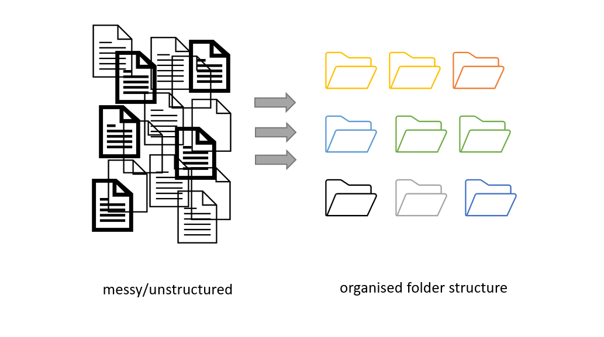

## Project organization: planning file names and folders structure

Before you even start collecting or working with data, you should decide how you will structure and name files and folders. This will:
* allow for standardized data collecting and analysis by many team members.
* make it easier for the researcher to determine where files should be saved.
* avoid file duplication.
* help to make retrieval and archiving more efficient.

*Figure credits: Andrés Romanowski*

Consistent naming and organizing files in folders has two main goals:
* quick finding needed files
* being able to tell the file content without opening it

## Naming your files (and folders)
One important and often overlooked aspect of organizing, sharing, and keeping track of data
files is standardising naming.
It is important to develop naming conventions
which permits encoding experimental factors which are important to the project.

File (folder) names should be consistent, meaningful to you and your collaborators,
allow you to easily find what you are looking for,
give you a sense of the content without opening the file,
and identify if something is missing.

> ## Naming and sorting (3+2 minutes)
> Have a look at the example files from a project, similar
> to the one from metadata episode.
>
> All the files have been sorted by name and
> demonstrate consequences of different naming strategies.
>
> For your information, to encode experimental details, following conventions were taken:
> * phyB/phyA are sample genotype,
> * sXX is sample number
> * LD/SD are different light conditions (long or short day)
> * on/off are different media (on sucrose, off sucrose)
> * measurement date
> * other details are timepoint and raw or normalized data
>
> > 2020-07-14_s12_phyB_on_SD_t04.raw.xlsx
> > 2020-07-14_s1_phyA_on_LD_t05.raw.xlsx
> > 2020-07-14_s2_phyB_on_SD_t11.raw.xlsx
> > 2020-08-12_s03_phyA_on_LD_t03.raw.xlsx
> > 2020-08-12_s12_phyB_on_LD_t01.raw.xlsx
> > 2020-08-13_s01_phyB_on_SD_t02.raw.xlsx
> > 2020-7-12_s2_phyB_on_SD_t01.raw.xlsx
> > AUG-13_phyB_on_LD_s1_t11.raw.xlsx
> > JUL-31_phyB_on_LD_s1_t03.raw.xlsx
> >
> > LD_phyA_off_t04_2020-08-12.norm.xlsx
> > LD_phyA_on_t04_2020-07-14.norm.xlsx
> > LD_phyB_off_t04_2020-08-12.norm.xlsx
> > LD_phyB_on_t04_2020-07-14.norm.xlsx
> > SD_phyB_off_t04_2020-08-13.norm.xlsx
> > SD_phyB_on_t04_2020-07-12.norm.xlsx
> > SD_phya_off_t04_2020-08-13.norm.xlsx
> > SD_phya_ons_t04_2020-07-12.norm.xlsx
> > ld_phyA_ons_t04_2020-08-12.norm.xlsx
> {: .source}
>
> * What are the problems with having date first?
> * How do different date formats behave once sorted?
> * Can you tell the importance of leading 0 (zeros)?
> * Is it equally easy to find all data from LD conditions as ON media?
> * Can you spot problem with when using different cases?
> * Do you see benefits of keeping consistent lengths of each name parts?
> * Do you see what happens when you mix conventions?
>
> > ## Solution
> >
> > * Using dates up front makes it difficult to quickly find data for
> > particular conditions or genotypes. It also masks the "logical" order of samples
> > or timepoints.
> > * Named months break the "expected" sorting, same as dates without leading 0
> > * Without leading zeros, 's12' appear before s1 and s2
> > * the first (and second) parts of the name are easiest to spot
> > * last file is also from LD conditions but do apearch after SD, same with 'phya' genotypes
> > * the last 3 file names are easiest to read as all parts appear on top of each other,
> > thanks to using same 3 letter-lemgth codes ons and off
> > * The lack of consistency makes it very difficult to get data from related samples/conditions.
> >
> {: .solution}
{: .challenge}

## Naming your files (and folders)
Some things to take into account to decide on your naming convention are:

- Does your convention make your files easy to sort
and find by the most important feature?
	- include any parameter that helps the name being as descriptive as
	possible (i.e.: project, experiment, researcher, sample, organism,
	date (range), data type, method)
    - defined a standard vocabulary (shortcuts) for parameters
	- decide which elements go in which order.

- Decide the convention when to use symbols, capitals, hyphens
(e.g kebab-case, CamelCase, or snake_case).

- Defined a maximum name length.
Aim for filenames no longer than ~30 characters.

- Document any abbreviation of your parameters.

**Do's:**
- for dates use the YYYY-MM-DD standard and place at the end of the file UNLESS you need to organise your files chronologically
- include version number (if applicable), use leading zeroes (i.e.: v005 instead of v5).
- make sure the 3-letter file format extension is present at the end of the name (e.g. .doc, .xls, .mov, .tif)
- add a **PROJECT_STRUCTURE** (README) file in your top directory which details your naming convention, directory structure and abbreviations

**Don'ts:**
- avoid using spaces (use _ or - instead)
- avoid dots, commas and special characters (e.g. ~ ! @ # $ % ^ & * ( ) ` ; < > ? , [ ] { } ‘ “)
- avoid using language specific characters (e.g óężé), unfortunately
they still cause problems with may software or between operating systems (OS)
- avoid long names
- avoid repetition, e.g if directory name is *Electron_Microscopy_Images*,
  and file *ELN_MI_IMG_20200101.img* then ELN_MI_IMG is redundant
- avoid deep paths with long names (i.e. deeply nested folders with long names)
as archiving or moving between OS may fail

If adding all the relevant details to file names makes them too long,
it is often a signal that you should use folder to organize the files and
capture some of those parameters.

> ## Folders vs Files (3 minutes)
>
> Have a look as these two different organization strategies:
>
> (1)
> |-- Project
> |-- |-- arab_LD_phyA_off_t04_2020-08-12.metab.xlsx
>
> (2)
> |-- Project
> |-- |-- arabidopsis
> |-- |-- |-- long_day
> |-- |-- |-- |-- phyA
> |-- |-- |-- |-- |-- off_sucrose_2020-08-12
> |-- |-- |-- |-- |-- |-- t04.metab.xlsx
>
> Can you think of scenarios in which one is better suited than other?
> Hint: think of other files that could be present as well.
>
> > ## Solution
> > The first strategies, can work very well if the project has only few files,
> > so all of them can quickly be accessed (no need to change folders) and
> > the different parameters are easily visible.
> > For example a couple of conditions, couple of genotypes or species
> >
> > |-- Project
> > |-- |-- arab_LD_phyA_off_t04_2020-08-12.metab.xlsx
> > |-- |-- arab_LD_WILD_off_t03_2020-08-11.metab.xlsx
> > |-- |-- arab_SD_phyA_off_t01_2020-05-12.metab.xlsx
> > |-- |-- arab_SD_WILD_off_t02_2020-05-11.metab.xlsx
> > |-- |-- rice_LD_phyA_off_t05_2020-05-02.metab.xlsx
> > |-- |-- rice_LD_WILD_off_t06_2020-05-02.metab.xlsx
> > |-- |-- rice_SD_phyA_off_t07_2020-06-02.metab.xlsx
> > |-- |-- rice_SD_WILD_off_t08_2020-06-02.metab.xlsx
> >
> > The second strategy works better if we have a lot of individual files for
> > each parameter.
> > For example, imagine the metabolites are measured hourly throughout the day,
> > and there are ten different genotypes, two species and 4 light conditions.
> > You would not want to have all the 2000 files in one folder.
> >
> > |-- Project
> > |-- |-- arabidopsis
> > |-- |-- |-- long_day
> > |-- |-- |-- |-- phyA
> > |-- |-- |-- |-- |-- off_sucrose_2020-08-12
> > |-- |-- |-- |-- |-- |-- t01.metab.xlsx
> > |-- |-- |-- |-- |-- |-- t02.metab.xlsx
> > |-- |-- |-- |-- |-- |-- t03.metab.xlsx
> > |-- |-- |-- |-- |-- |--     ...
> > |-- |-- |-- |-- |-- |-- t23.metab.xlsx
> > |-- |-- |-- |-- |-- |-- t24.metab.xlsx
> > |-- |-- rice
> > |-- |-- |-- long_day
> > |-- |-- |-- |-- phyA
> > |-- |-- |-- |-- |-- off_sucrose_2020-06-03
> > |-- |-- |-- |-- |-- |-- t01.metab.xlsx
> > |-- |-- |-- |-- |-- |--     ...
> > |-- |-- |-- |-- |-- |-- t24.metab.xlsx
> >
> {: .solution}
{: .challenge}

> ## Must do: Document your strategy
> Regardless of whether you are using long filenames or incorporating
> some of the variables within the folder structure, document it!
> Always include a PROJECT_STRUCTURE (or README) file describing your file naming and folder organisation conventions.
>
{: .callout}

## Strategies to set up a clear folder structure
Establishing a system that allows you to access your files,
avoid duplication and ensure that your data can be easily found
needs planning.

You can start by developing a logical folder structure. To do so, you need to take into account the following suggestions:

- Use folders to group related files. A single folder will make it easy to locate them.
- Name folders appropriately: use descriptive names after the areas of work to which they relate.
- Structure folders hierarchically: use broader topics for your main folders and increase in specificity as you go down the hierarchy.
- Be consistent: agree on a naming convention from the outset of your research project.

> ## Challenge (5 minutes)
> Take a look at the folder structure recommended by the
> [Good enough practices in scientific computing](https://doi.org/10.1371/journal.pcbi.1005510) paper.
> >
> > .
> > |-- CITATION
> > |-- README
> > |-- LICENSE
> > |-- requirements.txt
> > |
> > |-- data
> > |   |-- birds_count_table.csv
> > |
> > |-- doc
> > |   |-- notebook.md
> > |   |-- manuscript.md
> > |   |-- changelog.txt
> > |
> > |-- results
> > |   |-- summarized_results.csv
> > |
> > |-- src
> > |   |-- sightings_analysis.py
> > |   |-- runall.py
> > |
> >
> > Note: This project doesn't have a bin directory because it does not rely on any compiled software.
> {: .source}
> > ## Solution
> > The structure is a concrete example of how a simple scientific computing project might be organized.
> > * The root directory contains a README file that provides an overview of the project as a whole, a CITATION file that explains how to reference it, and a LICENSE file that states the licensing.
> > * The data directory contains a single CSV file with tabular data on bird counts (machine-readable metadata could also be included here).
> > * The src directory contains sightings_analysis.py, a Python file containing functions to summarize the tabular data, and a controller script runall.py that loads the data table, applies functions imported from sightings_analysis.py, and saves a table of summarized results in the results directory.
> {: .solution}
{: .challenge}

## Good enough practices for scientific computing recommendations
The [Good enough practices in scientific computing](https://journals.plos.org/ploscompbiol/article?id=10.1371/journal.pcbi.1005510#sec009) paper makes the following simple recommendations:
* Put each project in its own directory, which is named after the project
* Put text documents associated with the project in the 'doc' directory
* Put raw data and metadata in a 'data' directory
* Put files generated during cleanup and analysis in a 'results' directory
* Put project source code in the 'src' directory
* Put compiled programs in the 'bin' directory
* Name all files to reflect their content or function:
	- Use names such as 'bird_count_table.csv', 'notebook.md', or 'summarized_results.csv'.
	- Do not use sequential numbers (e.g., result1.csv, result2.csv) or a location in a final manuscript (e.g., fig_3_a.png), since those numbers will almost certainly change as the project evolves.

> ## After you have a plan
> Your naming conventions might need some adjustments as the project progresses. Don't despair, just document it!
> If you change the strategy, document it and update the files which followed the old convention
{: .callout}

## Backup your project files and folders
Always backup your data in 3 places, at least one off-site (cloud-storage). Don't just use a failure-prone option (i.e.: USB drive)
Warning! You may not be able to put everything in a public cloud (check your institutional guidelines).

> ## Challenge (2.5 minutes)
> How can you achieve this?
> > ## Solution:
> > - Check your institutional services regarding data backup
> > - Determine the 3 places where you will backup your data
> > - You need to set up automatic software to backup
> {: .solution}
{: .challenge}

## Project organization and FAIR guidelines
Did you realise that the suggestions we made above mean that you are including valuable metadata as part of your folder and file names? As we mentioned in the [Introduction to Metadata episode](../04-intro-to-metadata), metadata provides valuable information for us and others to be able to interpret your research data.

> ## Challenge - discussion (5 minutes)
> In groups, discuss:
> * how can planning project folder organisation and defining naming conventions help the process of FAIRification?
{: .challenge}

> ## Attribution
> Content of this episode was created using the following references as inspiration:
> - [Good enough practices in scientific computing (Wilson et al., 2017)](https://doi.org/10.1371/journal.pcbi.1005510)
> - [Organising your data](https://www.data.cam.ac.uk/data-management-guide/organising-your-data)
> - [Organising files and folders](https://www.wur.nl/en/Value-Creation-Cooperation/Collaborating-with-WUR-1/Organising-files-and-folders.htm)
> - [File naming](https://libguides.princeton.edu/c.php?g=102546&p=930626)
> - [Library Caprenty FAIR](https://librarycarpentry.org/lc-fair-research/05-reusable/index.html)
>
{: .callout}


