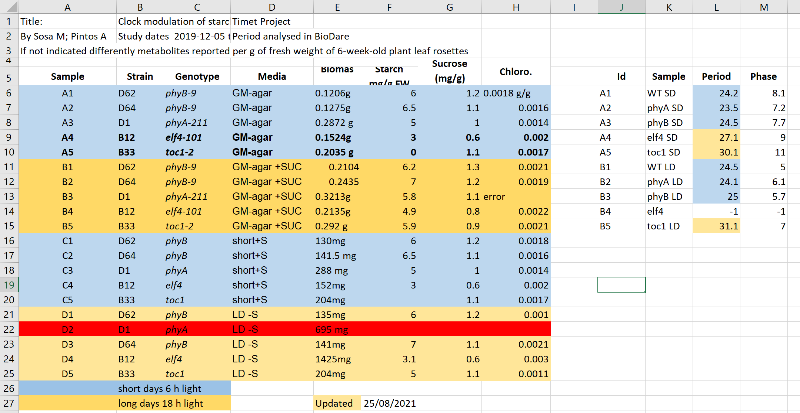

Tables are one of the best forms of storing and representing information.
That is why we find them almost everywhere, from a menue in a restaurant, by a bank
statement to professional databases. No surprise then, that we biologists love tables,
and we tend to love them in Excel.

Excel by being easy to use, yet flexible and powerful, often gives us too much freedom
which leads to bad practices and difficut to re-use data and metadata.

> ## What can go wrong with data in Excel
>
> Have a look at the example [data-file](../files/04-bad-metadata.xlsx) in Excel.
>
> 
>
> It contains data similar to the presented before, from some experiments on plants in
> different light conditions. Imagine you need to work with this file.
>
> 1. What you find confusing in this file, what would you try to clarify with its author before
> doing anything with it
> 2. What will be the issues with calculation of: average biomas, biomas per genotype
> 3. Typically, more advance data analysis is done programatically, which requires either
> conversion to a text format as csv, tsv format or using library that reads Excel file
> and "kind of make this conversion on the fly".
> Save this file in a text format, close Excel and reopen the saved files. What has changed?
>
> Have you seen similar tables? Do you believe this example is realistic?
>
>> ## Solution
>>
>> This files hopefully unreleasitcally exacerbate typical bad practices in Excel.
>> 1. Some things that may confuse:
>>      - why they are two tables, are period measurement related to the metabolics ie same samples
>>      - do colors in period table have the same meaning, seems no.
>>      - why row 22 is read while 13 says error
>>      - the meaning of values in media column
>>      - are the genotypes same in different blocks or not
>> 2.
>>      - Before averaging the biomas weight needs conversion to the same unit and removal of the text for unit.
>>      - Averaging per genotype needs manual selection of the suitable entries
>> 3.
>>      - information about light conditions is completely lost
>>      - the header columns are scrambled
>>      - the update date may change its meaning depending on the locale (swithc year with day)
> {: .solution}
{: .challenge}

## Common Spreadsheet Errors

### <a name="tables"></a> 1. Using multiple tables

Multiple data tables within one spreadsheet confuse both human and computers.
* For human, they prompt finding associations where they are not present.
* For computers, each spreadsheet row typically is treated as one observation.
And you are potentially using the same field name in multiple places.

In our example both column A and K named `sample` represented different inforamtion,
and values in row 6 from both parts were not related.

### <a name="tabs"></a> 2. Using multiple tabs

That seems like an easy way to organize data, right? Well, yes and no.

* tabs make it more difficult to do programmatic analysis
* tabs can be ignored (under the radar) when opening file, for example the recently used tab is shown first
other user may not notice that there are many other tabs before it (we have seen it a lot when importing data)

However,
* tabs seems like a perfect place to add adminstrative, descriptive metadata so they are next to data
while not "polluting" data table.
* having secondary data next to primary in subsequent tabs permits easy inspection of all without a need of
sending always collection of files.

Our recommendation use with cautions, the more automatic analysis you do, the less frequently use tabs.

### <a name="zeros"></a> 3. Not filling in zeros

It might be that when you're measuring something, it's
usually a zero, say the number of times a rabbit is observed in the survey.
Why bother writing in the number zero in that column, when it's mostly zeros?

However, there's a difference between a zero and a blank cell in a spreadsheet.
To the computer, a zero is actually data. You measured or counted it.
A blank cell means that it wasn't measured and the computer will interpret it as an unknown value (otherwise known as a
null value).

The spreadsheets or statistical programs will likely mis-interpret blank cells that you intend to be zeros.

Because of this, it's very important to record zeros as zeros and truly missing data as nulls.


### <a name="null"></a> 4. Using problematic null values
Example: using -999 or -1 or 0 (other numerical values) to represent missing data.

Other times different null values are used to convey different reasons why the data isn't there.
For example, -1 not recorded, -2 contamination etc.

This is important information to capture, but is in effect using one column to capture two pieces (real values
and comment or status).
It would be good here to create a new column like 'data_missing'
and use that column to capture the different reasons.

Whatever the reason, it's a problem if unknown or missing data is recorded as -999, 999, or 0.
Many statistical programs will not recognize
that these are intended to represent missing (null) values.

It is essential to use a clearly defined and consistent null indicator.
Blanks (most applications) and NA (for R) are good choices.

White et al, 2013, explain good choices for indicating null values for different software applications in their article:
[Nine simple ways to make it easier to (re)use your data.](https://peerj.com/preprints/7/) Ideas in Ecology and Evolution.


### <a name="formatting"></a> 5. Using formatting to convey information organizing data

Never highlight cells, rows or columns that should be excluded from an analysis,
or to mark particular properties/conditions.

In our example files information about light conditions is only encoded as a color.
Formatting information is not available to analysis software and alsmost ceratinly will be lost during
processing.

All the information should be encoded as a field value, for example in columns like:
condition, calibrated,
validated, omitted etc.

You can still use colors/fonts to help in readability (just make sure they help and
not distract) but no information should be lost if the data is exported to plain text.

If you’re not careful, formatting a worksheet to be more aesthetically pleasing can compromise
your computer’s ability to see associations in the data.

**Never merge cells, as it will make your data unreadable by statistics software**.
Don't leave blank rows to indicate separations in data

## <a name="units"></a> 6. Placing comments or units in cells

Most analysis software can't see Excel or LibreOffice comments,
and would be confused by comments placed within your data cells.

As described above for formatting, create another field if you need to add notes to cells.

Similarly, don’t include units in cells: ideally, all the measurements you place in one column
should be in the same unit, but if for some reason they aren’t, create another field and specify the units the cell is in.
A field value `0.123 g` will need to be parsed by a srcipt into `0.123` and `g` in order to be used
for calculations, why add extera work for others.


## <a name="info"></a> 7. Entering more than one piece of information in a cell

Don't include more than one piece of information in a cell (like `M30`, `F25`, for male age 30 and female 25,
or `Red light + Ampicilin + High nitrogen`).

This will limit the ways in which you can analyze your data.
Design your data sheet to include this information. For example, include one column for age of
individuals and a separate column for sex.

## <a name="consistency"></a> 8. Inconsistency in used values

Using "synonyms" or alternatives to describe the same values.

For example: `E. Coli`, `EColi`, `Escherichia coli` in the same table

## <a name="field_name"></a> 9. Using problematic field names
Choose descriptive field names, but be careful not to include spaces, numbers, or **special characters** of any kind (incluiding natinal characters: óęłń).
Spaces can be misinterpreted by parsers that use whitespace as delimiters and
some programs don’t like field names that are text strings that start with numbers.

Underscores (`_`) are a good alternative to spaces.
Consider writing names in camel case (like this: ExampleFileName) to improve
readability.

Remember that abbreviations that make sense at the moment may not be so obvious in 6 months,
but don't overdo it with names that are excessively long.

Including the units in the field names avoids confusion and enables others to readily interpret your fields.
Or add it in seperate row to help automatic unit conversions.

**Examples**

<table align = "left" style = "width =50%; border: 1px solid black;">
<tr>
	<td> <b>Good Name</b></td> <br />
	<td> <b>Good Alternative </b> </td><br />
	<td> <b>Avoid </b></td><br />
</tr>
<tr>
	<td> Max_temp_C</td>
	<td> MaxTemp </td>
	<td> Maximum Temp (°C) </td>
</tr>
<tr>
	<td> Precipitation_mm</td>
	<td> Precipitation</td>
	<td> precmm </td>
</tr>
<tr>
	<td> Mean_year_growth</td>
	<td> MeanYearGrowth </td>
	<td> Mean growth/year</td>
</tr>
<tr>
	<td> sex </td>
	<td> sex </td>
	<td> M/F </td>
</tr>
<tr>
	<td> weight </td>
	<td> weight </td>
	<td> w.</td>
</tr>
<tr>
	<td> cell_type </td>
	<td> CellType </td>
	<td> Cell Type </td>
</tr>
<tr>
	<td> Observation_01 </td>
	<td> first_observation</td>
	<td> 1st Obs</td>
</tr>
</table>

## <a name="special"></a> 10. Using special characters in data

For example, when writing longer text in a cell, people often include line breaks, em-dashes,
etc in their spreadsheet.  Also, when copying data in from applications such as Word, formatting and fancy non-standard characters (such
as left- and right-aligned quotation marks) are included.  When exporting this data into a coding/statistical environment or into a
relational database, dangerous things may occur,
such as lines being cut in half and encoding errors being thrown.

General best practice is to avoid adding characters such as newlines, tabs, vertical tabs and sadly national characters.
In other words, treat a text cell as if it were a simple web form that can only contain text and spaces.


## <a name="metadata"></a> 11. Values without field labels

It may be obvious for us that a cell `Ann Smart and Daniele Hardwork` contains authors and
`Starch content in Arrabidopis T. under different light conditions` is a title, but not so
for a computer program.

Always label the values preferable as the column headers, or as a first field on the left:
```
Author  |  Ann Samart  |  Daniele Hardwork
Title   |  Starch content in Arrabidopis T. under different light conditions
```

> ## Spotting problems
>
> Which of the problems discussed above:
>
>  1. Using multiple tables
>  2. Using multiple tabs
>  3. Not filling in zeros
>  4. Using problematic null values
>  5. Using formatting to convey information and organizing data
>  6. Placing comments or units in cells
>  7. Entering more than one piece of information in a cell
>  8. Inconsistency in used values
>  9. Using problematic field names
>  10. Using special characters in data
>  11. Values without field labels
>
> Can you spot in:
>   * Row 5
>   * Row 2
>   * Column C
>   * Column E
>   * Column L
>
>> ## Solution
>>
>> *  5, 9
>> *  11, 7
>> *  8
>> *  6, 5
>> *  3
> {: .solution}
{: .challenge}

> ## Clean data tables make life easier
>
> Let's check the cleaned version of the previous [file](../files/04-better-metadata.xlsx).
>
> Look how easy it is to calculate the average biomas, and if you have Office365, see how
> easy it is to get average value per genotype.
{: .callout}

## Outsmarted by Excel

Excel has built in autoformating function which can make biologist's life more difficult

> ## Finding the right date
>
> Open excel and type following values into the cells:
>
> |------|-------|--------|------|--------|--------|
> | Gene | SEPT2 | Sample | 0013 | Record | 12/5/4 |
> | Mar1 | 1 March | Mar-1 | 1-3 |14/3/20 | 43904
>
> * Is what you see what typed?
> * Can you force it?
> * Do you know which year the dates represent?
>
> {: .solution}
{: .challenge}

A team of Australian researchers analyzed nearly 3,600 genetics papers [Ziemann 2016](https://doi.org/10.1186/s13059-016-1044-7).
As is common practice in the field, these papers all came with supplementary files
containing lists of genes used in the research.

The Australian researchers found that roughly 1 in 5 of
these papers included errors in their gene lists that were due to Excel
automatically converting gene names to things like calendar dates or random numbers.

Those errors actually forced the renaming of 27 gene symbols
including SEPT4 (now SEPTIN4) and MARCH1 (now MARCHF1).

Storing and handling dates is generally problematic even in program languages,
as we tend to use dates in various formats and those formats are region specific.

Have you ever got confused by a meeting date from american collaborator?

If the dates are "real" data, for example sample collection from patient,
field measurement, and preventing misinterpretations is crucial, there are two safe options:

1. Store dates in 3 columns for year, month and day:

| Year | Month | Day
|------|-------|----
| 2021 | 3 | 16
| 2021 | 10 | 1

2. Store the date as an [ISO](https://en.wikipedia.org/wiki/ISO_8601) string:
`YYYYMMDD` e.g. `20210316`

Even though, normally `YYYY-MM-DD` format is preferred, it will be sadly reformatted by Excel according
to your locale!

When using text files (.csv, .tsv), You should always document what format you are using to represent dates.

> ## To use or not to use Excel
>
> Excel file format `.xlsx` is now an open, it is widely used and supported by external libraries
> and thus it could be considered interoperable, and nowadays it is admissible as being FAIR.
>
> However, plain text files like coma or tab separated values (.csv, .tsv) can be accessed without
> any special software. Data in a CSV file can also be easily imported into other formats
> and environments, such as SQLite and R. We’re not tied to a certain version of a certain
> expensive program when we work with CSV files,
> so it’s a good format to work with for maximum portability and endurance.
> If such files are handled only with text editors or programmatically (R, python)
> then they are safer option as prevent autoformating issues described before.
>
> If you analyse your data with R or python, or you know that your data are meant
> to be processed that way
> you should be using text formats whenever possible and as soon as you capture your data.
>
> However, if you only use Excel, and so does your community, just keep using it.
> Just be aware of possible pitfalls, especially when working with genes(protein)' names(accession numbers).
>
>
{: .callout}

> ## Cleaning data with Open Refine
>
> There are tools that help you to clean and reorganize existing data.
>
> [OpenRefine](https://openrefine.org/) is a powerful tool for working with messy data:
> cleaning it; transforming it from one format into another;
> and extending it with web services and external data.
>
> With OpenRefine you can find and merge the synonyms like: `E. Coli`, `EColi`, `Escherichia coli` into one,
> or split values in the `Name` field into `FirstName` and `LastName`.
>
> There is a carpentry course available:
> [Data Cleaning with OpenRefine for Ecologists](https://datacarpentry.org/OpenRefine-ecology-lesson/)
>
{: .callout}


> ## Data tables and FAIR
>
> How the described practices for representing data in tables (Excel, .csv or .tsv)
> help in achieving FAIR? Which aspects of FAIR they help with.
>
>
{: .challenge}


## I am a section

With a text.


*After [Figure source](https://www.figure.link/)*


> ## I am a yellow info
>
> And my text.
{: .callout}


~~~
I am code
~~~
{: .source}


> ## I am a problem
>
> Defined here.
>
>> ## Solution
>>
>> *   I am an answer.
>> *   So am I.
> {: .solution}
{: .challenge}


> ## Attribution
> Content of this episode was adopted after XXX et al.
> [YYY](https://biodare2.ed.ac.uk).
{: .callout}



