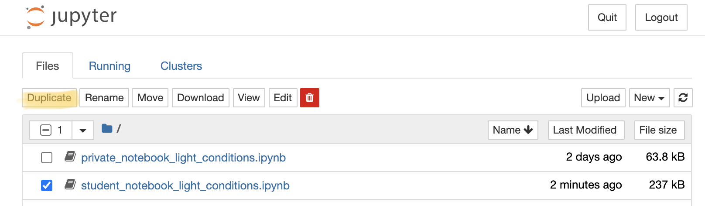
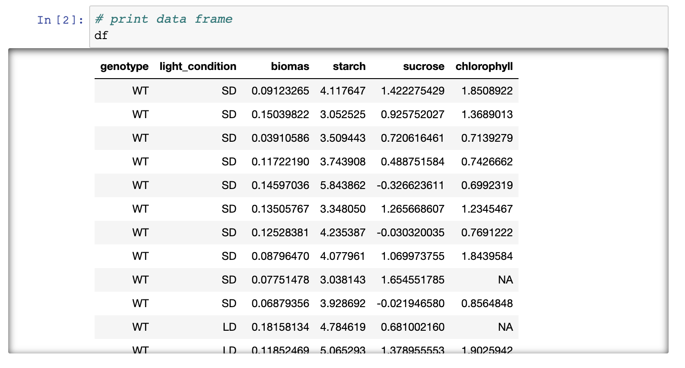
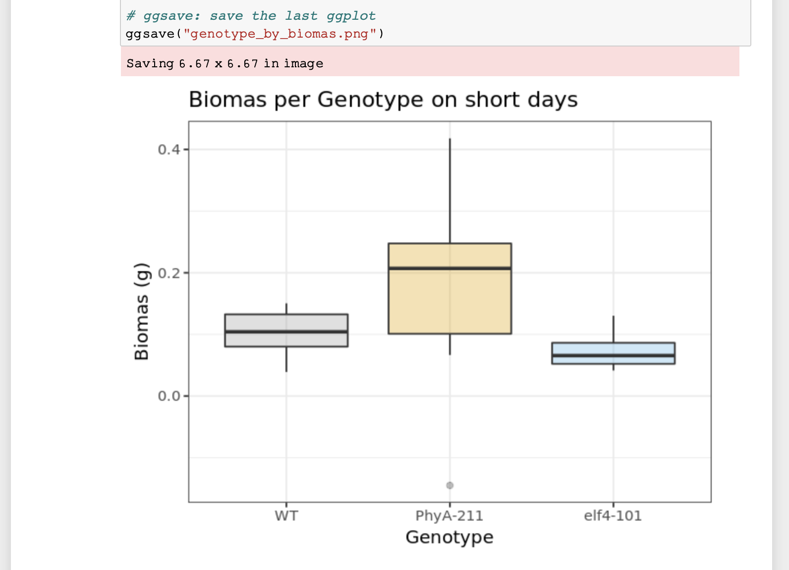
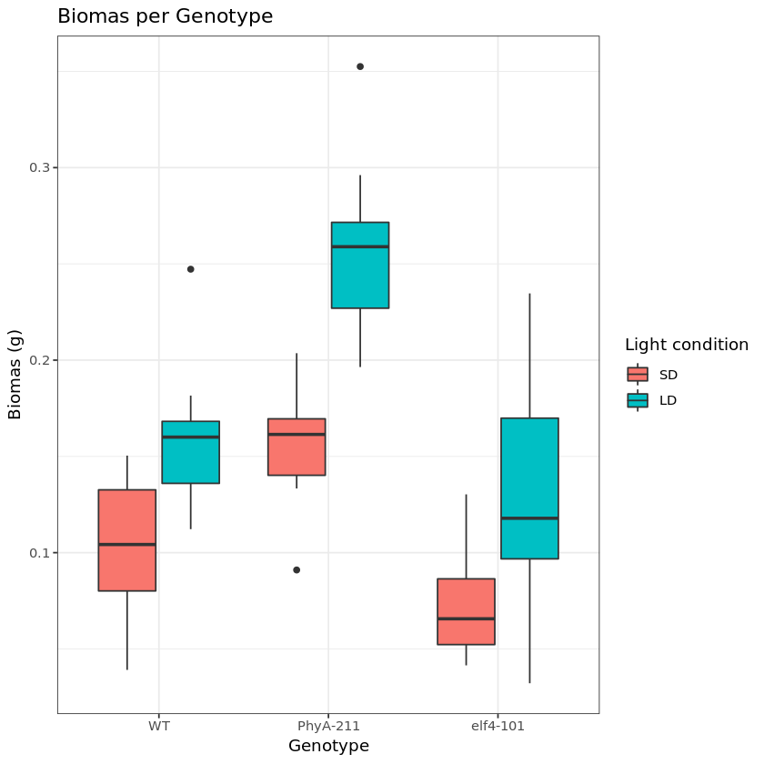

## Reusable Computing
We have previously discussed electronic lab notebooks and their benefit in being FAIR.
If you are working with large datasets, mathematical models, complex visualisations of 
your data then you might already be frustrated by having to copy and paste your figures
into your electronic lab notebook after each iteration of new code, and you might have
already lost track of which code corresponded to which figure and why you changed your 
code last time.

There is a simple solution to this: **Computational notebooks**

## Computational Notebooks - Jupyter Notebook for FAIR practices
Computational notebooks are essentially laboratory notebooks for scientific computing.
Instead of pasting DNA gels alongside lab protocols, researchers embed code, data and 
text to document their computational methods. A free and popular tool that is being
used across specialities is **the Jupyter notebook**.

[Jupyter](www.jupyter.org) Notebooks are interactive web applications which allow you 
to type and edit lines of code in the programming languages July (Ju), Python (Py), or R,
hence it's name Jupyter, and view the output (e.g. graphs or calculations) immediately. 
The huge benefit of such notebooks is that source code is mixed with documentation, thus
explaining experimental setup, analysis, results of tables and plots throughout.

What is left for us to do is write the code that will analyse our data, and explain 
the narrative behind the experiment and interpretation of the results. For data 
scientists, this format can drive exploration via interactive computing. This is an 
environment in which users execute code, see what happens, modify and repeat in an 
iterative process between researcher and data.
As a basic principle Jupyter Notebooks run on a 'kernel' which is responsible in
execution of the code. Generally this 'kernel' can run on your computer, additionally
external servers (e.g. our BioRDM server which we use below to host our notebook) can 
be provided for you to store and analyse your data. Notebooks can also be exported as 
.pdf and .html files which allow easy sharing of outputs, and other tools such as [nbviewer](https://nbviewer.org/), 
an open-source service that allows users to render their Jupyter notebooks on GitHub 
in a web browser without having to install the software or any programming libraries. 

## Working with Jupyter Notebooks

To show you how easy it is to work with Jupyter Notebooks, we have 
created an exercise for you where we will work on "real-life" data 
from an experiment looking at circadian influence on plants following
short-day and long-day light exposure. We will create some graphs and 
test whether there are differences between our genotypes of arabidopsis
using R.

> ## Exercise - basics of Jupyter notebooks
>
> Open this [Jupyter notebook](http://mango.bio.ed.ac.uk:8888/tree), we
> will first show you how to duplicate a notebook and save it and how to
> run the code:
>
> 1. Select the notebook titled 'student_notebook_light_conditions.ipynb'
> as depicted below and click 'Duplicate'. Confirm with Duplicate when you
> are asked if you are certain that you want to duplicate the notebook.
> *Figure 1. Duplicate a Jupyter notebook*
>
> 1. A copy of the notebook has appeared with the suffix '-Copy' and a
> number (**Figure 2a**), select this notebook. Have a look around the
> notebook and explore its anatomy (**Figure 2**), you should see
> experimental details, an image, and code. If you click on separate parts
> of the notebook you can see that it is divided into individual cells
> (**Figure 2 e-g**) which are of varying type (Code, R in this case, or
> Markdown - **Figure 2d**). Hashtags are comments within the code and shall help you to interpret what individual bits of code do.
> 
> *Figure 2. Anatomy of a Jupyter notebook: (a) depicts the name of the
> notebook, (b, c) are toolbars, (c) contains the most commonly used
> tools, (d) shows of what type - Markdown, Code etc... - the currently
> selected cell is, and (e-g) are examples of cells, where (e) shows the
> currently selected cell.*
>
> 1. Change the title of the notebook (**a**) to your initials e.g. "student_notebook_light_conditions_IB"
> 1. To Save the notebook click on the disk symbol in the toolbar (**c**).
> 1. To run the code select the top cell of the notebook (**e**) - this is
> likely pre-selected already - and click "Run" in the tool bar (**c**). The
> selected cell jumps one cell down (**f**).
> 1. To avoid having to press Run repeatedly until we are at the end of
> the code (try clicking Run two more times and see what happens), we will
> show you how to run all the code. In the top tool bar (**b**) click "Cell"
> and select "Run All". ("Cell > Run All".)
> 1. If you have another look at the notebook you can see that a table,
> graph and outputs of statistical testing have been generated.
>
>> ## Solution
>> If you followed all steps correctly you should have reproduced the
>> table, a graph and statistical testing. Apart from the pre-filled
>> markdown text the rendered values of the code should look like this:
>> 
>>*Figure 3. Rendering of data frame*
>> 
>>*Figure 4. Rendering of plot*
> {: .solution}
{: .challenge}

## Coding Good Practices
Before we let you go wild in our subsequent exercises we would like to go highlight a
few standards and best practices that will help you generate cleaner, more readable, 
more efficient code.

### Advantages of using Coding Standards
* ability to retrace code created by different programmers (uniformity)
* reusable code
* easier to detect errors
* code is simpler, more readable, easier to maintain
* allows to generate faster results and work more efficiently

### Best Practices
* write as few lines as possible (this will make your code faster)
* use appropriate names to describe your variables: e.g. df for dataframe instead of x
* segment blocks of code in the same section into paragraphs e.g. note the difference below following two code blocks

```
## Wrong
library(ggplot2)
df <- read.delim(file = "light_results.txt")
df
df$genotype <- factor(df$genotype, levels = c("WT", "PhyA-211","elf4-101"))
options(repr.plot.width = 5, repr.plot.height = 4)
ggplot(subset(df, light_condition %in% "SD"),
       mapping = aes(x = genotype, y = biomas, fill = genotype)) +
    geom_boxplot() +
    labs(title = "Biomas per Genotype on short days",
        x = "Genotype",
        y = "Biomas (g)") +
    scale_fill_manual(values=c("#999999", "#E69F00", "#56B4E9"))
```  

```
## Better
df <- read.delim(file = "light_results.txt")
df

df$genotype <- factor(df$genotype, levels = c("WT", "PhyA-211","elf4-101"))

options(repr.plot.width = 5, repr.plot.height = 4)
ggplot(subset(df, light_condition %in% "SD"),
       mapping = aes(x = genotype, y = biomas, fill = genotype)) +
    geom_boxplot() +
    labs(title = "Biomas per Genotype on short days",
        x = "Genotype",
        y = "Biomas (g)") +
    scale_fill_manual(values=c("#999999", "#E69F00", "#56B4E9"))
```
* use indentations to mark the beginning and end of structures: note the difference in 
the two code blocks below. The indentations clearly mark that mapping belongs within 
the function of ggplot, x and y clearly belong to labs. The other functions are being 
passed to the ggplot function and allow to change overall plot appearance.

```
## Wrong
ggplot(subset(df, light_condition %in% "SD"),
mapping = aes(x = genotype, y = biomas, fill = genotype)) +
geom_boxplot() +
labs(title = "Biomas per Genotype on short days",
x = "Genotype",
y = "Biomas (g)") +
scale_fill_manual(values=c("#999999", "#E69F00", "#56B4E9"))
```

```
## Better
ggplot(subset(df, light_condition %in% "SD"),
       mapping = aes(x = genotype, y = biomas, fill = genotype)) +
    geom_boxplot() +
    labs(title = "Biomas per Genotype on short days",
        x = "Genotype",
        y = "Biomas (g)") +
    scale_fill_manual(values=c("#999999", "#E69F00", "#56B4E9"))
```
* Whilst indentations are great, don't go too deep, as this will make code harder to 
read and follow.
* Don't repeat yourself!! If there is a repetitive task, automate this using a function 
or already existing packages (R and Python have many data wrangling packages available)
* Avoid long lines: horizontal block text is easier to read for us humans. Note the 
difference between these two code blocks

```
## Wrong
ggplot(subset(df, light_condition %in% "SD"), mapping = aes(x = genotype, y = biomas, fill = genotype)) + geom_boxplot() + labs(title = "Biomas per Genotype on short days", x = "Genotype", y = "Biomas (g)") + scale_fill_manual(values=c("#999999", "#E69F00", "#56B4E9"))
```

```
## Better
ggplot(subset(df, light_condition %in% "SD"),
       mapping = aes(x = genotype, y = biomas, fill = genotype)) +
    geom_boxplot() +
    labs(title = "Biomas per Genotype on short days",
        x = "Genotype",
        y = "Biomas (g)") +
    scale_fill_manual(values=c("#999999", "#E69F00", "#56B4E9"))
```
* most importantly leave comments of what your code does! Describe code functions
throughout, add headers in between analysis steps (if code is self-explanatory this is not
necessary - e.g. in our lesson we annotated all code as not everyone is familiar with R)
```
## Ideal

## plot the graph using ggplot
ggplot(subset(df, light_condition %in% "SD"), # subset only SD from light condition column
       mapping = aes(x = genotype, y = biomas, fill = genotype)) + # colours are by genotype
    geom_boxplot() +
    labs(title = "Biomas per Genotype on short days", # define plot title, and x- and y-axis
        x = "Genotype",
        y = "Biomas (g)") +
    scale_fill_manual(values=c("#999999", "#E69F00", "#56B4E9")) # change colour of groups
```

> ## Exercise - how to add and remove content
> In your previously saved notebook, we will now show you how to add text
> and remove cells within your notebook. Additionally we will show you how
> to change code:
> 1. We want to change the author name to your name: Double click on the
> cell containing the author name. You can see how the layout of the cell
> changes into Markdown, and you can simply change the name.
> 2. Press the Run button in the toolbar and the Markdown of the cell will
> be rendered again and you can see the text shows as previously.
> 3. We now want to add some details about the "light_results.txt" file
> which is being loaded. To add a cell above the code, click the cell 
> currently above the first lines of code and click the "+" in the toolbar.
> This creates a cell below selected cell.
> 4. Now add a note about the file which is being loaded and the purpose
> of the subsequent analysis: e.g. Loading of results following short- and
> long-day light exposure on arabidopsis, followed by visualisation of
> differences in chlorophyll/biomas etc... content between genotypes on 
> short-days and long-days. To show the cell as Markdown and not code,
> make sure "Markdown" is selected in the toolbar.
> 5. To remove a cell, select it and click on the scissors icon in the
> toolbar (This can be undone under Edit > Undo Delete Cells).
> 6. To change the output of your graph click on the cell containing the
> code below the "Visualise data" title. We want you to change the colours
> of the box-plots. You can do this where the comment "# change colour of
> groups" is written. Either you can use three different HEX codes (a
> 6-symbol code representing colours from white to black), or colours
> simply by their name - e.g. dark blue, orange...
> 7. To save the graph under a different name add your initials to the
> file name under which the image is being saved. Press Run again. Your
> image should be visible in the overall file hierarchy.
{: .challenge}

## Jupyter Notebooks are easy to use and great for collaborative efforts
Imagine your collaborators have shared this experiment measuring biomas of
*Arabidopsis* with you and you were able to duplicate and follow their
entire analysis from start to finish, including interpretation of data.
Now you are interested in analysing what biomas look like on long-days.
You are in luck! 

Because Jupyter Notebooks are so easy to handle you simply need to copy
and paste the already existing code your collaborators shared and adapt
variables such as short-day to long-day and change the names under which
figures are being saved to avoid duplication.

> ## Exercise - add another analysis step
> We have shown you how to manipulate text and code in Jupyter notebooks,
> now we want you to add data visualisation (a graph) and stats for long-
> day light condition:
> 1. Add additional cells including
> * titles
> * edited code to depict graph from long-days and not short-days
> * Figure legend
> * statistical testing of difference between genotypes on long-days
> * interpretation of results of statistical testing.
>
>> ## Solution
>> The following code will result in your new graph:
>> ~~~
>> ggplot(subset(df, light_condition %in% "LD"), 
>> # subset only SD from >>light condition column for plotting
>>       mapping = aes(x = genotype, y = biomas, fill = genotype)) + 
>> # x-axis shows genotype, y-axis shows biomas
>>    geom_boxplot(alpha=0.3) +
>>    labs(title = "Biomas per Genotype on long days",
>>        x = "Genotype", # Title of x-axis
>>        y = "Biomas (g)") + # Title of y-axis
>>    # change colour of groups
>>    scale_fill_manual(values=c("#999999", "#E69F00", "#56B4E9")) +
>>    theme_bw() +
>>    theme(legend.position="none")
>> ~~~
>> {: .source}
>>
>> The following code will result in testing of biomas between genotypes
> in long-days - we assign a new variable to separate both analysis.
>> ~~~
>> res.aov.LD <- aov(biomas ~ genotype, data = subset(df, light_condition %in% "LD"))
# Summary of the analysis
summary(res.aov.LD)
>> ~~~
>> {: .source}
>> 
>> The following code will result in Tukey multiple pairwise-comparison
> testing.
>> ~~~
>> # conduct Tukey multiple pairwise-comparison
TukeyHSD(res.aov.LD)
>> ~~~
>> {: .source}
> {: .solution}
{: .challenge}

## Easy sharing of your notebook
We have now managed to not only reproduce code, but we were able to add to the analysis and interpretation of overall results. To show your PI and colleagues your results, you want to save the notebook in readable format.

> ## Exercise - Sharing of your Jupyter Notebook
> 1. Download your Notebook (ensure all code has been run) as .html and .pdf
> 2. View the documents and think about why it is important to run all code before download (try Cell > All Output > Clear and download your Notebook then and compare)
>
>> ## Solution
>> It is important all code is run before the notebook is downloaded, as during download only the text and graphs are saved that are currently visible in your notebook.
> {: .solution}
{: .challenge}

> ## Exercise - Accessibility of Jupyter Notebooks
>
> On a scale from -2 to 2, how do you feel about the following statements (R is interchangeable with Python), where -2 (strongly disagree), 0 no 
opinion to +2 strongly agree:
> * making graphs for a subset of data is easier in R than in Excel
> * it is easier to filter for data in R than in Excel
> * it is easier to apply formulas or calculations in R than in Excel
> * it is easier to generate a series of plots with similar layout in R than Excel
> * it is easier to do large scale data processing in R than in Excel
> * using notebooks does not require any programming knowledge
> * notebooks give you a better overview of your data processing than Excel
> * Jupyter is free, whilst a Microsoft Office (+Excel) suite costs $149.99, this alone is an incentive to use Jupyter notebooks as not all individuals have Microsoft Office supported by their employers
> * you need to learn R to do any data processing in notebooks
{: .challenge}

> ## Attribution
> Content of this episode was adopted after XXX et al.
> [Why Jupyter is a data scientists' computational notebook of choice](https://doi.org/10.1038/d41586-018-07196-1)
> [Coding Standards best practices](https://www.browserstack.com/guide/coding-standards-best-practices)
{: .callout}

> ## Further Reading
> [Reproducible analysis and Research Transparency](https://reproducible-analysis-workshop.readthedocs.io/en/latest/4.Jupyter-Notebook.html)
{: .callout}

>## For instructors: Advanced teaching
> For experienced Notebook users who normally use Python:
> * Create your own notebook using Python instead of R, replicate the above code-output
> 
> For experienced R users:
> * Plot both short- and long-day light conditions as a grouped boxplot
>  
>> ## Solution
>> ```
>> ggplot(df, mapping = aes(x = genotype, y = biomas, fill=light_condition)) +
>>     geom_boxplot() +
>>     labs(title = "Biomas per Genotype",
>>         x = "Genotype",
>>         y = "Biomas (g)",
>>         fill = "Light condition") +
>>     theme_bw()
>> ```
>> 
>>*Figure 5. Short- and long-day light conditions depicted as a grouped boxplot*
> {: .solution}
{: .callout}


